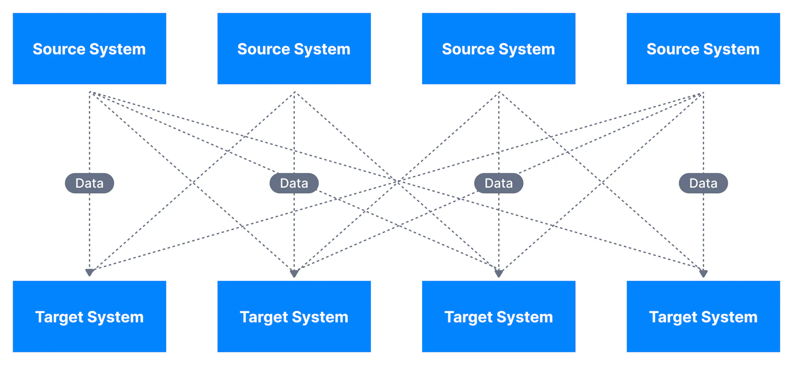
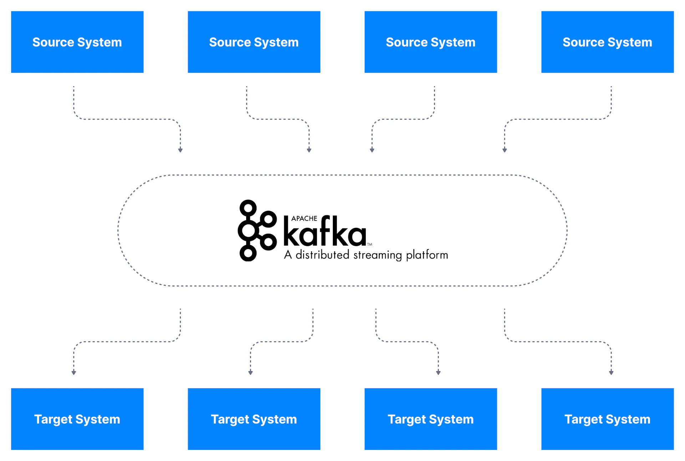
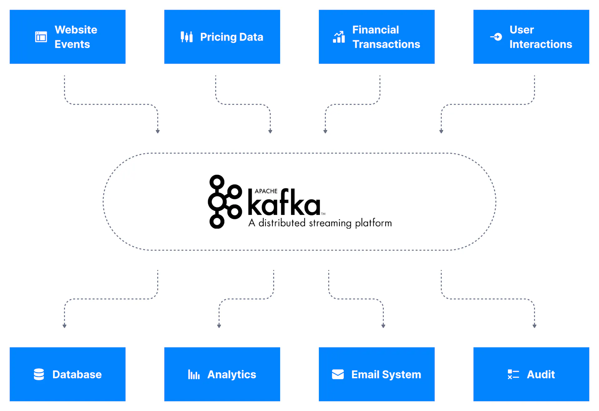
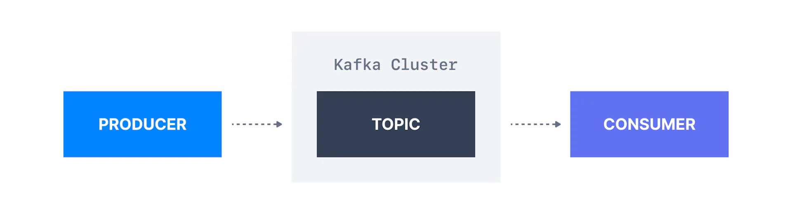
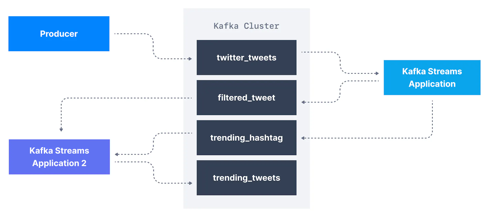
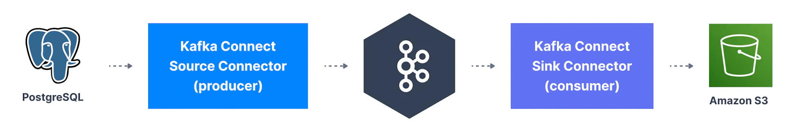
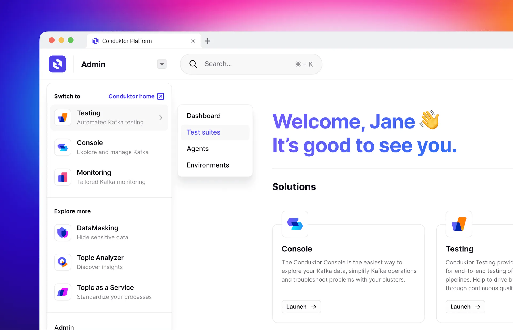
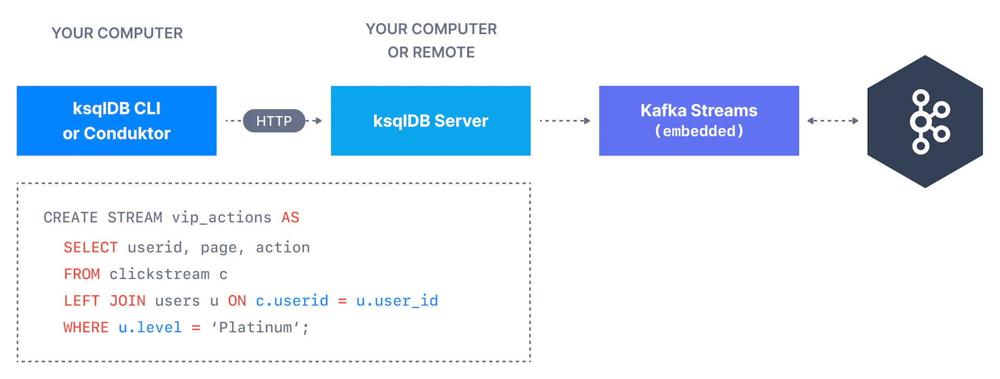

When it comes to data event streaming, Apache Kafka is the de facto standard. It is an open-source distributed system consisting of servers and clients. Apache Kafka is used primarily to build real-time data streaming pipelines.

Apache Kafka is used by thousands of the world's leading organizations for high-performance data pipelines, streaming analytics, data integration and many other vital applications.

In this 3 part introductory series, you will learn:

- [What Apache Kafka is and where it came from](https://www.conduktor.io/kafka/what-is-apache-kafka#Part-1:-Data-Integration-Challenges)

- [What the main components of Apache Kafka are](https://www.conduktor.io/kafka/what-is-apache-kafka#Part-2:-Defintion-of-Core-Apache-Kafka-Concepts)

- [What the Apache Kafka ecosystem is](https://www.conduktor.io/kafka/what-is-apache-kafka#Part-3:-The-Kakfa-Ecosystem)

By the end, you will confidently understand Apache Kafka and its place in the data streaming world.

___

Looking for a headstart on Apache Kafka? The Conduktor Platform is the ultimate way to start learning Apache Kafka. [Try it now for free](https://www.conduktor.io/get-started) and find out how easy Kafka can be.

___

## Part 1: Data Integration Challenges

Context

A typical organization has multiple sources of data with disparate data formats. Data integration involves combining data from these multiple sources into one unified view of their business.

A typical business collects data through a variety of applications, e.g., accounting, billing, CRM**,** websites, etc. Each of these applications have their own processes for data input and update. In order to get a unified view of their business, engineers have to develop bespoke integrations between these different applications.

These direct integrations can result in a complicated solution as shown below.

Each integration comes with difficulties around

- **Protocol** – how the data is transported (TCP, HTTP, REST, FTP, JDBC…)

- **Data format** – how the data is parsed (Binary, CSV, JSON, Avro…)

- **Data schema & evolution** – how the data is shaped and may change

## Apache Kafka to the rescue

Decoupling Different Data Systems

Apache Kafka allows us to decouple data streams and systems.

With Apache Kafka as a data integration layer, data sources will publish their data to Apache Kafka and the target systems will source their data from Apache Kafka. This decouples source data streams and target systems allowing for a simplified data integration solution, as you can see in the diagram below.

## What is a data stream in Apache Kafka?

A data stream is typically thought of as a potentially unbounded sequence of data. The name streaming is used because we are interested in the data being accessible as soon as it is produced.

Each of the applications in an organization where data is created is a potential data stream creator. Data created as part of data streams are typically small. The data throughput to data streams is highly variable: some streams will receive tens of thousands of records per second, and some will receive one or two records per hour.

Apache Kafka is used to store these data streams (also called topics), which then allows systems to perform stream processing - an act of performing continual calculations on a potentially endless and constantly evolving source of data. Once the stream is processed and stored in Apache Kafka, it may be transferred to another system, e.g., a database.

## Examples of Data streams

The following are examples of some of data streams in real-world that companies process

- **Log Analysis**. Modern applications include tens to thousands of microservices - all of which constantly produce logs. These logs are full of information that can be mined for business intelligence, failure prediction, and debugging. The challenge then is how to process these large volumes of log data being produced in one place. Companies push log data into a data stream to perform stream processing.

- **Web Analytics**. Another common use for streaming data is web analytics. Modern web applications measure almost every user activity on their site, e.g., button clicks, page views. These actions add up fast. Stream processing allows companies to process data as it is generated and not hours later.

## Why should a company use Apache Kafka?

As soon as a company has real-time data streaming needs, a streaming platform must be put in place.

Apache Kafka is one of the most popular data streaming processing platforms in the industry today, being used by more than 80% of the Fortune 100 companies. Kafka provides a simple message queue interface on top of its append-only log-structured storage medium. It stores a log of events. Data is distributed to multiple nodes. Kafka is highly scalable and fault-tolerant to node loss.

Kafka has been deployed in sizes ranging from just one node to thousands of nodes. It is used extensively in production workloads in companies such as Netflix, Apple, Uber, Airbnb, in addition to LinkedIn. The creators of Kafka left LinkedIn to form their own company called Confluent to focus full-time on Kafka and its ecosystem. Apache Kafka is now an open-source project maintained by Confluent.

## Apache Kafka History

Kafka was created at LinkedIn to service internal stream processing requirements that could not be met with traditional message queueing systems. Its first version was released in January 2011. Kafka quickly gained popularity and since then became one of the most popular projects of the Apache Foundation.

The project is now mainly maintained by Confluent, with help from other companies such as IBM, Yelp, Netflix and so on.

## What are the use cases of Apache Kafka?

The use cases of Apache Kafka are many. These include stream processing for different business applications. Apache Kafka makes up the storage mechanism for some of the prominent stream processing frameworks, e.g., Apache Flink, Samza.

- Messaging systems

- Activity Tracking

- Gather metrics from many different locations, for example, IoT devices

- Application logs analysis

- De-coupling of system dependencies

- Integration with Big Data technologies like Spark, Flink, Storm, Hadoop.

- Event-sourcing store

You can find a list of use cases at [https://kafka.apache.org/uses](https://kafka.apache.org/uses)

## Where is Apache Kafka not a great fit?

Apache Kafka is a great fit for the use cases outlined above, but there are a few use cases when using Apache Kafka is either not possible or not recommended:

- **Proxying millions of clients** for mobile apps or IoT: the Kafka protocol is not made for that, but some proxies exist to bridge the gap.

- **A database with indexes:** Kafka is an event streaming log with no analytical capability built in and no complex query model.

- **An embedded real-time technology for IoT:** there are lower level and lighter alternatives to perform these use cases on embedded systems.

- **Work queues:** Kafka is made of topics, not queues (unlike RabbitMQ, ActiveMQ, SQS). Queues are meant to scale to millions of consumers and to delete messages once processed. In Kafka data is not deleted once processed and consumers cannot scale beyond the number of partitions in a topic.

- **Kafka as a blockchain**: Kafka topics present some characteristics of a blockchain, where data is appended in a log, and Kafka topics can be immutable, but lack some key properties of blockchains such as the cryptographic verification of the data, as well as full history preservation.

## How is Kafka concretely being used within the industry?

Apache Kafka is widely used in the industry. Some of the use cases are highlighted below.

- **Uber** uses Kafka extensively in their real-time pricing pipeline. Kafka is the backbone through which a significant proportion of the events are communicated to the different stream processing calculations. The speed and flexibility of Kafka allows Uber to adjust their pricing models to the constantly evolving events in the real world (number of available drivers and their position, users and their position, weather event, other events), and bill users the right amount to manage offer and demand.

- **Netflix** has integrated Kafka as the core component of its data platform. They refer to it internally as their Keystone data pipeline. As part of Netflix's Keystone, Kafka handles billions of events a day. Just to give an idea about the huge amount of data that Kafka can handle, Netflix sends about 5 hundred billion events and 1.3 petabytes of data per day into Kafka.

Unknown to many, Kafka is at the core of lots of the services we enjoy on a daily basis from some of the world's largest tech companies such as Uber, Netflix, Airbnb, LinkedIn, Apple & Walmart.

## Part 2: Definition of Core Apache Kafka Concepts

Now that we've learned about Apache Kafka at a high level, let's dive in and learn how to use the tool. In this part, we will cover the basics of Kafka topics, producers, and consumers.

## What is a Kafka Topic?

Kafka topics organize related events. For example, we may have a topic called **logs,** which contains logs from an application. Topics are roughly analogous to SQL tables. However, unlike SQL tables, Kafka topics are not queryable. Instead, we must create Kafka producers and consumers to utilize the data. The data in the topics are stored in the key-value form in binary format.

## What is a Kafka Producer?

Once a topic is created in Kafka, the next step is to send data into the topic. Applications that send data into a topic are known as Kafka producers. There are many ways to produce events to Kafka, but applications typically integrate with Kafka client libraries in languages like Java, Python, Go, as well as many other languages.

Note that Kafka producers are deployed outside Kafka and only interact with Apache Kafka by sending data directly into the Kafka topics.

## What is a Kafka Consumer?

Once a topic has been created and data produced into the topic, we can have applications that make use of the data stream. Applications that pull event data from one or more Kafka topics are known as Kafka consumers. There are many ways to consume events from Kafka, but applications typically integrate with Kafka client libraries in languages like Java, Python, Go, as well as many other languages. By default consumers only consume data that was produced after the consumer first connected to the topic.

Note that Kafka consumers are deployed outside Kafka and only interact with Apache Kafka by reading data directly from Kafka topics.

## Part 3: The Kafka Ecosystem

A number of additional tools and libraries have been developed for Kafka over the years to expand its functionality. In this section, we'll look at some of the most popular parts of the wider Kafka ecosystem.

## What is Kafka Streams?

Once we have produced data from external systems into Kafka, we may want to process them using stream processing applications. Stream processing applications make use of streaming data stores like Apache Kafka to provide real-time analytics.

For example, let's assume we are having a Kafka topic named `twitter_tweets` that is a data streaming of all tweets on Twitter. From this topic, we may want to:

- Filter only tweets that have over `10` likes or replies, to capture important tweets

- Count the number of tweets received for each hashtag every `1` minute

- Combine the two to get trending topics and hashtags in real-time!

In order to perform topic-level transformation within Apache Kafka, we can use streaming libraries that are meant for this use case instead of writing very complicated producer & consumer code.

In that case, we can leverage the Kafka Streams library, which is a stream processing framework that is released alongside Apache Kafka. Alternatives you may have heard of for Kafka Streams are Apache Spark, or Apache Flink.

## What is Kafka Connect?

In order to get data into Apache Kafka, we have seen that we need to leverage Kafka producers. Over time, it has been noticed that many companies shared the same data source types (databases, systems, etc...) and so writing open-source standardized code could be helpful for the greater good. The same thinking goes for Kafka Consumers.

Kafka Connect is a tool that allows us to integrate popular systems with Kafka. It allows us to re-use existing components to source data into Kafka and sink data out from Kafka into other data stores.

Examples of popular Kafka Connectors include:

- **Kafka Connect Source Connectors (producers)**: Databases (through the Debezium connector), JDBC, Couchbase, GoldenGate, SAP HANA, Blockchain, Cassandra, DynamoDB, FTP, IOT, MongoDB, MQTT, RethinkDB, Salesforce, Solr, SQS, Twitter, etc…

- **Kafka Connect Sink Connectors (consumers):** S3, ElasticSearch, HDFS, JDBC, SAP HANA, DocumentDB, Cassandra, DynamoDB, HBase, MongoDB, Redis, Solr, Splunk, Twitter

## What is the Schema Registry?

The Schema Registry helps register data schemas in Apache Kafka and ensure that producers and consumers will be compatible with each other while evolving. It supports the Apache Avro, Protobuf and JSON-schema data formats.

Data Schemas

**Data schemas** define for your data the expected fields, their names, and value types

Without a schema registry, producers and consumers are at the risk of breaking when the data schema changes.

[<u>The Conduktor Platform</u>](https://www.conduktor.io/) is a complete, end-to-end solution for Kafka development, encompassing Kafka management, testing, monitoring, data quality, and data governance. It allows developers to interact with the entire Kafka ecosystem such as Brokers, Topics, Consumers, Producers, Kafka Connect, and Confluent Schema Registry.

Conduktor Platform

## What is ksqlDB?

ksqlDB is a stream processing database that provides a SQL-like interface to transform Kafka topics and perform common database-like operations such as joins, aggregates, filtering, and other forms of data manipulation on streaming data.

Behind the scenes, the ksqlDB webserver translates the SQL commands into a series of Kafka Streams applications.

How ksqlDB works

## Next Reading Steps

We hope that this page allowed you to learn about Apache Kafka and its ecosystem at a high level.

If you would like to start using Apache Kafka, we recommend you simply keep on reading these lessons in the order outlined and let us guide you in your Apache Kafka journey!

Happy learning :)