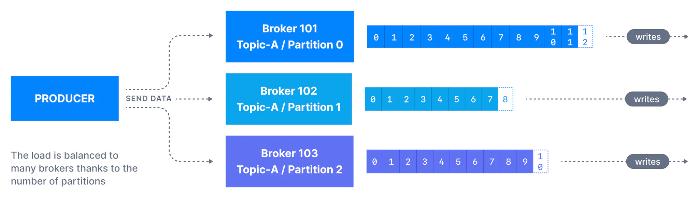
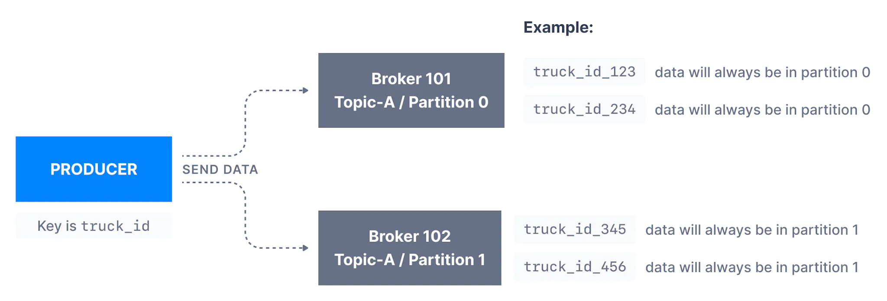
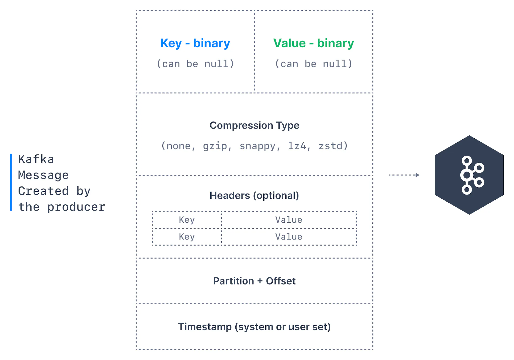
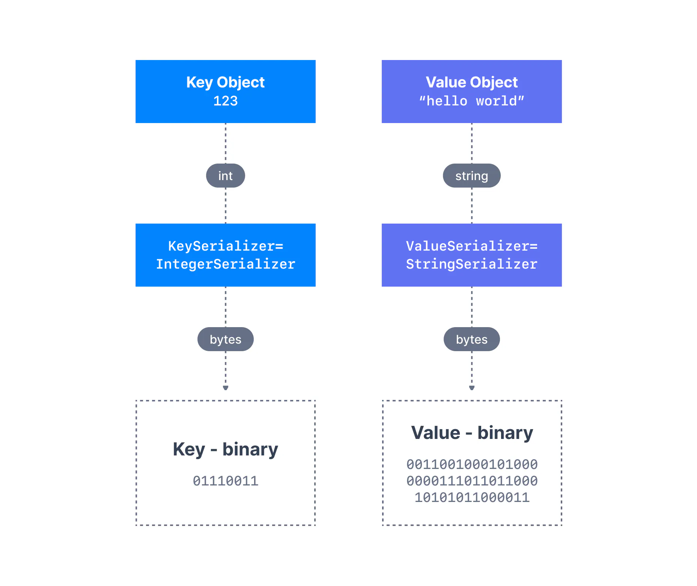

Once a topic has been created with Kafka, the next step is to send data into the topic. This is where Kafka Producers come in.

Applications that send data into topics are known as Kafka producers. Applications typically integrate a Kafka client library to write to Apache Kafka. Excellent client libraries exist for almost [all programming languages](https://www.conduktor.io/kafka/kafka-sdk-list/) that are popular today including Python, Java, Go, and others.

A Kafka producer sends messages to a topic, and messages are distributed to partitions according to a mechanism such as key hashing (more on it below).

For a message to be successfully written into a Kafka topic, a producer must specify a level of acknowledgment (acks). This subject will be introduced in depth in the [topic replication](https://www.conduktor.io/kafka/kafka-topic-replication/) section.

## Message Keys

Each event message contains an optional key and a value.

In case the key (`key=null`) is not specified by the producer, messages are distributed evenly across partitions in a topic. This means messages are sent in a round-robin fashion (partition _p0_ then _p1_ then _p2_, etc... then back to _p0_ and so on...).

**If a key is sent** (`key != null`)**, then all messages that share the same key will always be sent and stored in the same Kafka partition**. A key can be anything to identify a message - a string, numeric value, binary value, etc.

Kafka message keys are commonly used when there is a need for message ordering for all messages sharing the same field. For example, in the scenario of tracking trucks in a fleet, we want data from trucks to be in order at the individual truck level. In that case, we can choose the key to be `truck_id`. In the example shown below, the data from the truck with id _truck\_id\_123_ will always go to partition _p0._

Messages with Keys

You will learn about the process of key hashing (the process determining which key goes to which partition) at the bottom of this page.

## Kafka Message Anatomy

Kafka messages are created by the producer. A Kafka message consists of the following elements:

Structure of a Kafka Message

- **Key**. Key is optional in the Kafka message and it can be null. A key may be a string, number, or any object and then the key is serialized into binary format.

- **Value**. The value represents the content of the message and can also be null. The value format is arbitrary and is then also serialized into binary format.

- **Compression Type**. Kafka messages may be compressed. The compression type can be specified as part of the message. Options are `none`, `gzip`, `lz4`, `snappy`, and `zstd`

- **Headers**. There can be a list of optional Kafka message headers in the form of key-value pairs. It is common to add headers to specify metadata about the message, especially for tracing.

- **Partition + Offset**. Once a message is sent into a Kafka topic, it receives a partition number and an offset id. The combination of topic+partition+offset uniquely identifies the message

- **Timestamp**. A timestamp is added either by the user or the system in the message.

## Kafka Message Serializers

In many programming languages, the key and value are represented as objects, which greatly increases the code readability. However, Kafka brokers expect byte arrays as keys and values of messages. The process of transforming the producer's programmatic representation of the object to binary is **called message serialization**.

As shown below, we have a message with an `Integer` key and a `String` value. Since the key is an integer, we have to use an `IntegerSerializer` to convert it into a byte array. For the value, since it is a string, we must leverage a `StringSerializer`.

Message Serialization

As part of the Java Client SDK for Apache Kafka, [several serializers already exist](https://github.com/a0x8o/kafka/tree/master/clients/src/main/java/org/apache/kafka/common/serialization), such as string (which supersedes JSON), integer, float. Other serializers may have to be written by the users, but commonly distributed Kafka serializers exist and are efficiently written for formats such as [JSON-Schema](https://github.com/confluentinc/schema-registry/blob/master/json-schema-serializer/src/main/java/io/confluent/kafka/serializers/json/KafkaJsonSchemaSerializer.java), [Apache Avro](https://github.com/confluentinc/schema-registry/blob/master/avro-serializer/src/main/java/io/confluent/kafka/serializers/KafkaAvroSerializer.java) and [Protobuf](https://github.com/confluentinc/schema-registry/blob/master/protobuf-serializer/src/main/java/io/confluent/kafka/serializers/protobuf/KafkaProtobufSerializer.java), thanks to the Confluent Schema Registry.

Serialization Support

If you are not using a JVM-based programming language for serialization and deserialization, ensure that your Kafka client library supports the data formats that you need!

## For the curious: Kafka Message Key Hashing

A Kafka partitioner is a code logic that takes a record and determines to which partition to send it into.

Default Partitioner

In that effect, it is common for partitioners to leverage the Kafka message keys to route a message into a specific topic-partition. As a reminder, all messages with the same key will go to the same partition.

Kafka Key Hashing

**Key Hashing** is the process of determining the mapping of a key to a partition.

In the default Kafka partitioner, the keys are hashed using the **murmur2 algorithm,** with the formula below for the curious:

`1` `targetPartition = Math.abs(Utils.murmur2(keyBytes)) % (numPartitions - 1)`

It is possible to override the default partitioner via the producer property `partitioner.class`, although it is not advisable unless you know what you are doing.