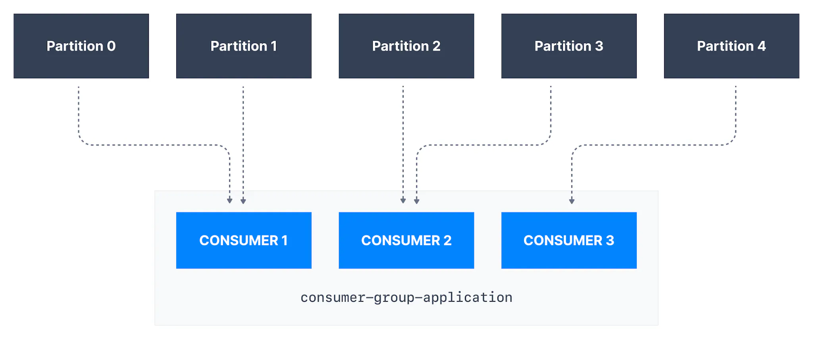
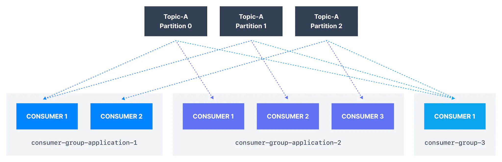
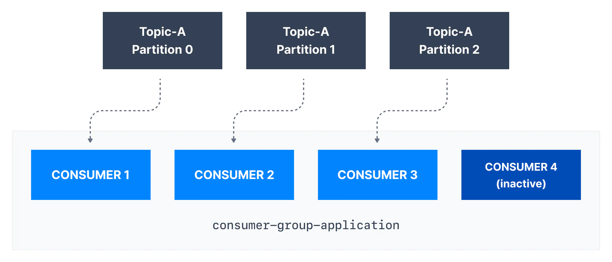
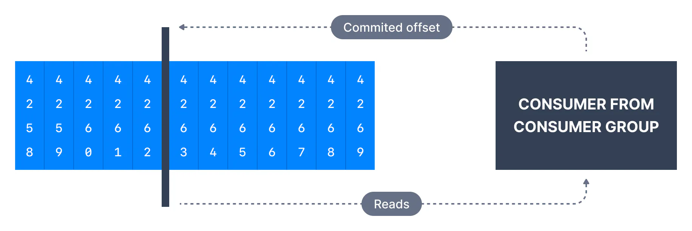

We have seen that consumers can consume data from Kafka topics partitions individually, but for horizontal scalability purposes it is recommended to consume Kafka topics as a group.

___

Consumers that are part of the same application and therefore performing the same "logical job" can be grouped together as a Kafka consumer group.

A topic usually consists of many partitions. These partitions are a unit of parallelism for Kafka consumers.

The benefit of leveraging a Kafka consumer group is that the consumers within the group will coordinate to split the work of reading from different partitions.

## Kafka Consumer Group ID

In order for indicating to Kafka consumers that they are part of the same specific group , we must specify the consumer-side setting `group.id`.

Kafka Consumers automatically use a `GroupCoordinator` and a `ConsumerCoordinator` to assign consumers to a partition and ensure the load balancing is achieved across all consumers in the same group.

It is important to note that each topic partition is only assigned to one consumer within a consumer group, but a consumer from a consumer group can be assigned multiple partitions.

In the example above, _Consumer 1_ of consumer group _consumer-group-application-1_ has been assigned _Partition 0_ and _Partition 1_, whereas _Consumer 2_ is assigned _Partition 2_ and _Partition 3_, and finally _Consumer 3_ is assigned _Partition 4_. Only _Consumer 1_ receives messages from _Partition 0_ and _Partition 1_, while only consumer _Consumer 2_ receives messages from _Partition 2 and 3,_ and only _Consumer 3_ receives messages from _Partition 4_.

Each of your applications (that may be composed of many consumers) reading from Kafka topics must specify a different `group.id`. That means that multiple applications (consumer groups) can consume from the same topic at the same time:

Kafka Consumer Groups

If there are more consumers than the number of partitions of a topic, then some consumers will remain inactive as shown below. Usually, we have as many consumers in a consumer group as the number of partitions. If we want more consumers for higher throughput, we should create more partitions while creating the topic. Otherwise, some of the consumers may remain inactive.

More consumers than partitions

___

## Kafka Consumer Offsets

Kafka brokers use an internal topic named `__consumer_offsets` that keeps track of what messages a given **consumer group** last successfully processed.

As we know, each message in a Kafka topic has a partition ID and an offset ID attached to it.

Therefore, in order to "checkpoint" how far a consumer has been reading into a topic partition, the consumer will regularly **commit** the latest processed message, also known as **consumer offset**.

In the figure below, a consumer from the consumer group has consumed messages up to offset `4262`, so the consumer offset is set to `4262`.

Consumer Offset

Most client libraries automatically commit offsets to Kafka for you on a periodic basis, and the responsible Kafka broker will ensure writing to the `__consumer_offsets` topic (therefore consumers do not write to that topic directly).

The process of committing offsets is not done for every message consumed (because this would be inefficient), and instead is a periodic process.

This also means that when a specific offset is committed, all previous messages that have a lower offset are also considered to be committed.

___

## Why use Consumer Offsets?

Offsets are critical for many applications. If a Kafka client crashes, a rebalance occurs and the latest committed offset help the remaining Kafka consumers know where to restart reading and processing messages.

In case a new consumer is added to a group, another consumer group rebalance happens and consumer offsets are yet again leveraged to notify consumers where to start reading data from.

Therefore consumer offsets must be committed regularly.

### Delivery semantics for consumers

By default, Java consumers automatically commit offsets (controlled by the `enable.auto.commit=true` property) every `auto.commit.interval.ms` (5 seconds by default) when `.poll()` is called.

Details of that mechanism are discussed in [Delivery Semantics for Consumers](https://www.conduktor.io/kafka/delivery-semantics-for-kafka-consumers/).

A consumer may opt to commit offsets by itself (`enable.auto.commit=false`). Depending on when it chooses to commit offsets, there are delivery semantics available to the consumer. The three delivery semantics are explained below.

- At most once:
  
  - Offsets are committed as soon as the message is received.
  
  - If the processing goes wrong, the message will be lost (it won’t be read again).

- At least once (usually preferred):
  
  - Offsets are committed after the message is processed.
  
  - If the processing goes wrong, the message will be read again.
  
  - This can result in duplicate processing of messages. Therefore, it is best practice to make sure data processing is idempotent (i.e. processing the same message twice won't produce any undesirable effects

- Exactly once:
  
  - This can only be achieved for Kafka topic to Kafka topic workflows using the transactions API. The Kafka Streams API simplifies the usage of that API and enables exactly once using the setting `processing.guarantee=exactly_once_v2` (`exactly_once` on Kafka < 2.5)
  
  - For Kafka topic to External System workflows, to _effectively_ achieve exactly once, you must use an idempotent consumer.

In practice, at least once with idempotent processing is the most desirable and widely implemented mechanism for Kafka consumers.