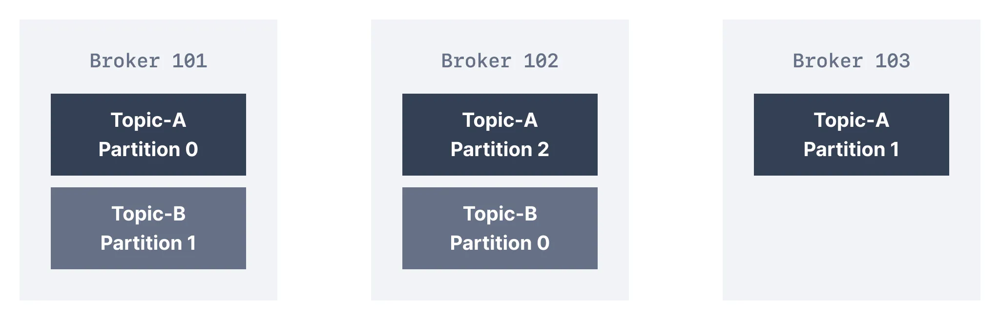
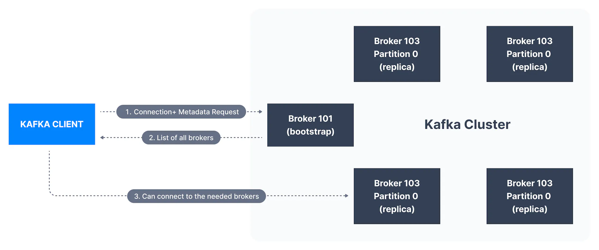

In the last lesson, we learned that a topic may have more than one partition. Each partition may live on different servers, also known as Kafka brokers.

## What is a Kafka Broker?

A single Kafka server is called a Kafka Broker. That Kafka broker is a program that runs on the Java Virtual Machine (Java version 11+) and usually a server that is meant to be a Kafka broker will solely run the necessary program and nothing else.

## What is Kafka Cluster?

An ensemble of Kafka brokers working together is called a Kafka cluster. Some clusters may contain just one broker or others may contain three or potentially hundreds of brokers. Companies like Netflix and Uber run hundreds or thousands of Kafka brokers to handle their data.

A broker in a cluster is identified by a unique numeric ID. In the figure below, the Kafka cluster is made up of three Kafka brokers.

Kafka Cluster

## Kafka Brokers and Topics

Kafka brokers store data in a directory on the server disk they run on. Each topic-partition receives its own sub-directory with the associated name of the topic. The advanced internals of how Kafka stores data is discussed in [Kafka Topics Internals: Segments and Indexes](https://www.conduktor.io/kafka/kafka-topics-internals-segments-and-indexes/).

To achieve high throughput and scalability on topics, Kafka topics are partitioned. If there are multiple Kafka brokers in a cluster, then partitions for a given topic will be distributed among the brokers evenly, to achieve load balancing and scalability.

Kafka Topic Partitions

In the diagram above, there are two topics illustrated - _Topic-A_ has three partitions. They are distributed evenly among the three available brokers in the cluster. Alternatively, there may be fewer (or more) partitions of a topic than the number of brokers in the cluster. _Topic-B_, in our case, has two partitions only. In this case, _Broker 103_ does not contain any partition of _Topic-B_.

There is no relationship between the broker ID and the partition ID - Kafka does a good job of distributing partitions evenly among the available brokers. In case the cluster becomes unbalanced due to an overload of a specific broker, it is possible for Kafka administrators to rebalance the cluster and move partitions.

Do not worry: one aspect that is discussed in [in the next page](https://www.conduktor.io/kafka/kafka-topic-replication/) is around how partitions are placed on Kafka brokers when topics are replicated.

## How do clients connect to a Kafka Cluster (bootstrap server)?

A client that wants to send or receive messages from the Kafka cluster **may connect to any broker in the cluster.** Every broker in the cluster has metadata about all the other brokers and will help the client connect to them as well, and **therefore any broker in the cluster is also called a bootstrap server.**

The bootstrap server will return metadata to the client that consists of a list of all the brokers in the cluster. Then, when required, the client will know which exact broker to connect to to send or receive data, and accurately find which brokers contain the relevant topic-partition.

Connecting to a Kafka Cluster

In practice, it is common for the Kafka client to reference at least two bootstrap servers in its connection URL, in the case one of them not being available, the other one should still respond to the connection request. That means that Kafka clients (and developers / DevOps) do not need to be aware of every single hostname of every single broker in a Kafka cluster, but only to be aware and reference two or three in the connection string for clients.