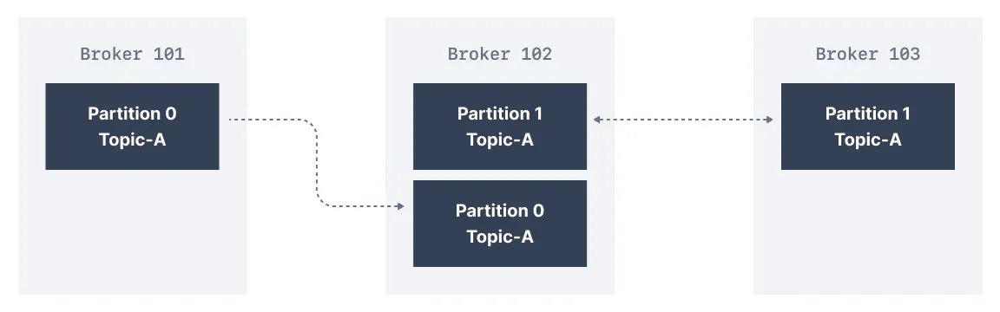
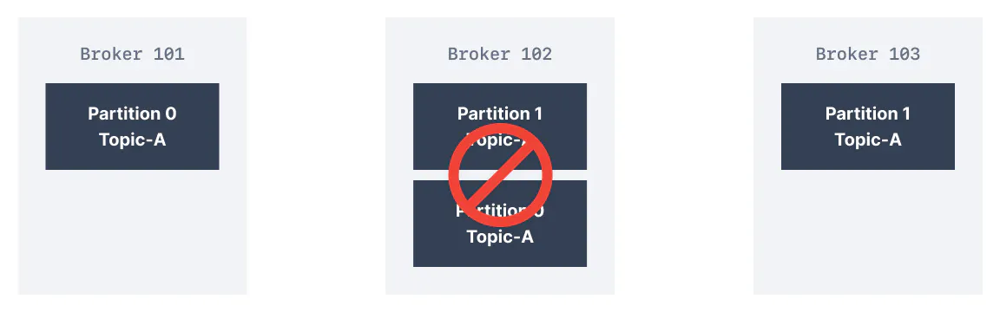
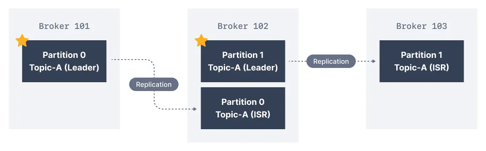
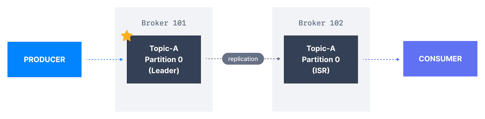

**One of the main reasons for Kafka's popularity, is the resilience it offers in the face of broker failures.** Machines fail, and often we cannot predict when that is going to happen or prevent it. Kafka is designed with replication as a core feature to withstand these failures while maintaining uptime and data accuracy.

Kafka Replication

Data Replication helps prevent data loss by writing the same data to more than one broker

In Kafka, replication means that data is written down not just to one broker, but many.

The replication factor is a topic setting and is specified at topic creation time.

- A replication factor of `1` means no replication. It is mostly used for development purposes and should be avoided in test and production Kafka clusters

- A replication factor of `3` is a commonly used replication factor as it provides the right balance between broker loss and replication overhead.

In the cluster below consisting of three brokers, the replication factor is `2`. When a message is written down into _Partition 0_ of _Topic-A_ in _Broker 101_, it is also written down into _Broker 102_ because it has _Partition 0_ as a replica.

Kafka Topic Replication

Thanks to a replication factor of 2, we can withstand the failure of one broker. This means that if _Broker 102_ failed, as you see below, _Broker 101 & 103_ would still have the data.

Kafka Broker Failure

## What are Kafka Partitions Leader and Replicas?

For a given topic-partition, one Kafka broker is designated by the cluster to be responsible for sending and receiving data to clients. That broker is known as the leader broker of that topic partition. Any other broker that is storing replicated data for that partition is referred to as a replica.

Therefore, each partition has one leader and multiple replicas.

## What are In-Sync Replicas (ISR)?

An ISR is a replica that is up to date with the leader broker for a partition. Any replica that is not up to date with the leader is out of sync.

Leaders & In-Sync Replicas

Here we have _Broker 101_ as _Partition 0_ leader and _Broker 102_ as the leader of _Partition 1_. _Broker 102_ is a replica for _Partition 0_ and _Broker 103_ is a replica for _Partition 1_. If the leader broker were to fail, one of the replicas will be elected as the new partition leader by an election.

## Kafka producers acks setting

Kafka producers only write data to the current leader broker for a partition.

Kafka producers must also specify a level of acknowledgment `acks` to specify if the message must be written to a minimum number of replicas before being considered a successful write.

Default acks values in Kafka v3.0

The default value of `acks` has changed with Kafka v3.0

- if using Kafka < v3.0, `acks=1`

- if using Kafka >= v3.0, `acks=all`

### acks=0

When `acks=0` producers consider messages as "written successfully" the moment the message was sent without waiting for the broker to accept it at all.

acks = 0

If the broker goes offline or an exception happens, we won’t know and will lose data. This is useful for data where it’s okay to potentially lose messages, such as metrics collection, and produces the highest throughput setting because the network overhead is minimized.

### acks = 1

When `acks=1` , producers consider messages as "written successfully" when the message was acknowledged by only the leader.

acks = 1

Leader response is requested, but replication is not a guarantee as it happens in the background. If an ack is not received, the producer may retry the request. If the leader broker goes offline unexpectedly but replicas haven’t replicated the data yet, we have a data loss.

### acks = all

When `acks=all`, producers consider messages as "written successfully" when the message is accepted by all in-sync replicas (ISR).

acks = all

The lead replica for a partition checks to see if there are enough in-sync replicas for safely writing the message (controlled by the broker setting `min.insync.replicas`). The request will be stored in a buffer until the leader observes that the follower replicas replicated the message, at which point a successful acknowledgement is sent back to the client.

The`min.insync.replicas` can be configured both at the topic and the broker-level. The data is considered committed when it is written to all in-sync replicas - `min.insync.replicas.` A value of 2 implies that at least 2 brokers that are ISR (including leader) must respond that they have the data.

If you would like to be sure that committed data is written to more than one replica, you need to set the minimum number of in-sync replicas to a higher value. If a topic has three replicas and you set `min.insync.replicas` to `2`, then you can only write to a partition in the topic if at least two out of the three replicas are in-sync. When all three replicas are in-sync, everything proceeds normally. This is also true if one of the replicas becomes unavailable. However, if two out of three replicas are not available, the brokers will no longer accept produce requests. Instead, producers that attempt to send data will receive `NotEnoughReplicasException`.

Kafka Topic Replication, ISR & Message Safety

## Kafka Topic Durability & Availability

For a topic replication factor of 3, topic data durability can withstand the loss of 2 brokers. As a general rule, for a replication factor of `N`, you can permanently lose up to `N-1` brokers and still recover your data.

Regarding availability, it is a little bit more complicated... To illustrate, let's consider a replication factor of 3:

- Reads: As long as one partition is up and considered an ISR, the topic will be available for reads

- Writers:
  
  - `acks=0` & `acks=1` : as long as one partition is up and considered an ISR, the topic will be available for writes.
  
  - `acks=all`:
    
    - `min.insync.replicas=1` (default): the topic must have at least 1 partition up as an ISR (that includes the reader) and so we can tolerate two brokers being down
    
    - `min.insync.replicas=2`: the topic must have at least 2 ISR up, and therefore we can tolerate at most one broker being down (in the case of replication factor of 3), and we have the guarantee that for every write, the data will be at least written twice.
    
    - `min.insync.replicas=3`: this wouldn't make much sense for a corresponding replication factor of 3 and we couldn't tolerate any broker going down.
    
    - in summary, when `acks=all` with a `replication.factor=N` and `min.insync.replicas=M` we can tolerate `N-M` brokers going down for topic availability purposes

Kafka Topic Replication Settings

`acks=all` and `min.insync.replicas=2` is the most popular option for data durability and availability and allows you to withstand at most the loss of **one** Kafka broker

## Kafka Consumers Replicas Fetching

Kafka consumers read by default from the partition leader.

But since Apache Kafka 2.4, it is possible to configure consumers to read from in-sync replicas instead (usually the closest).

Reading from the closest in-sync replicas (ISR) may improve the request latency, and also decrease network costs, because in most cloud environments cross-data centers network requests incur charges.

## Preferred leader

The preferred leader is the designated leader broker for a partition at topic creation time (as opposed to being a replica).

Leader Election

The process of deciding which broker is a leader at topic creation time is called a preferred leader election.

When the preferred leader goes down, any partition that is an ISR (in-sync replica) is eligible to become a new leader (but not a preferred leader). Upon recovering the preferred leader broker and having its partition data back in sync, the preferred leader will regain leadership for that partition.