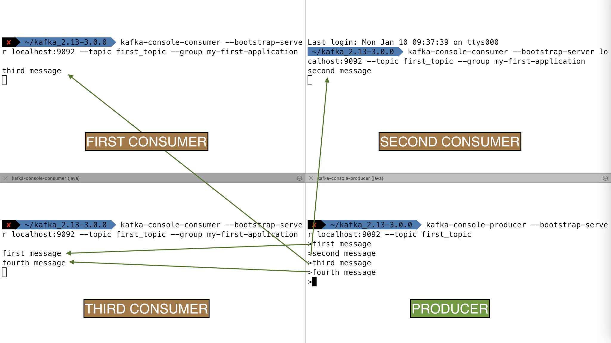
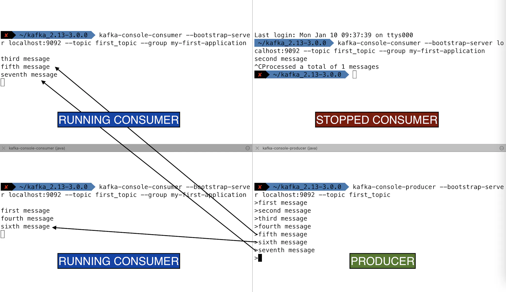
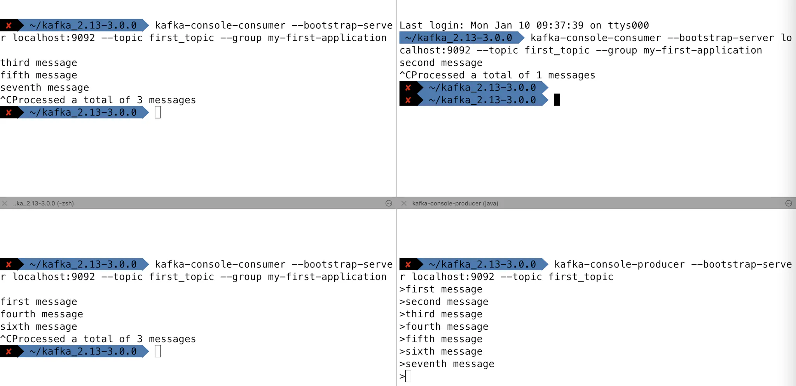

In this section, we will illustrate different scenarios to learn how Kafka consumers in a consumer group work using Kafka console consumer CLI, `kafka-console-consumer` tool.

Before we start using the CLI, make sure you have [started Kafka](https://www.conduktor.io/kafka/starting-kafka/) beforehand.

CLI Extensions

Use CLI commands with appropriate extensions for your platform, e.g., `kafka-console-consumer.bat` for windows, `kafka-console-consumer.sh` for Linux

In addition, we will provide an optional consumer group parameter with `--group` flag.

## How to create consumers in a Kafka Consumer Group?

To start consumers in a consumer group, do the following:

1. Create a topic with at least 2 partitions and send data to it

2. Create a first `kafka-console-consumer` and assign a group name with `--group`

3. Open a new terminal / shell window

4. Create a second `kafka-console-consumer` and use the same `--group` argument

5. Send data to the topic and you will see consumers sharing the reads

If you need a refresh on how consumers in a consumer group work, [have a read here](https://www.conduktor.io/kafka/kafka-consumer-groups-and-consumer-offsets/).

### Create Consumer Group Example

You cannot have more consumers in a group than partitions in your Kafka topic, and therefore we first need to create a Kafka topic with a few partitions (in the example 3).

`1` `kafka-topics.sh --bootstrap-server localhost:9092 --topic first_topic --create --partitions 3 --replication-factor 1`

Then launch a consumer in a consumer group, named `my-first-application`

`1` `kafka-console-consumer.sh --bootstrap-server localhost:9092 --topic first_topic --group my-first-application`

Open a new terminal/shell window and launch a second consumer in the same consumer group `my-first-application` (note we're using the exact same command)

`1` `kafka-console-consumer.sh --bootstrap-server localhost:9092 --topic first_topic --group my-first-application`

Open a new terminal/shell window and launch a third consumer in the same consumer group `my-first-application`

`1` `kafka-console-consumer.sh --bootstrap-server localhost:9092 --topic first_topic --group my-first-application`

Each consumer in the consumer group `my-first-application` will get assigned a partition. Produce a few string messages in the topic.

`1 2 3 4 5` `$ kafka-console-producer.sh --bootstrap-server localhost:9092 --topic first_topic >first message >second message >third message >fourth message`

Each consumer will show only the messages produced on the partition that are assigned to it.

If you stop a consumer, messages automatically get sent to the remaining consumers because consumers in a consumer group automatically perform a **consumer rebalance**.

### Stop all consumers

**And keep on producing to the topic**

`1 2 3` `>eigth message >ninth message >tenth message`

**Upon restart of a consumer in the group, the consumer will read from the latest committed offsets and read only the messages you've just produced**

`1 2 3 4 5` `$ kafka-console-consumer.sh --bootstrap-server localhost:9092 --topic first_topic --group my-first-application eigth message ninth message tenth message`

You have seen how consumers work in consumer groups!

### Gotchas

- If you consume in a consumer groups using the `--group` command, then if you try using the `--from-beginning` option afterwards with the same group, it will be ignored. Instead, you need to reset your consumer groups as [shown here](https://www.conduktor.io/kafka/kafka-consumer-group-management-cli-tutorial/).

- If you don't specify a --group option, the consumer group of the consumer will be a random consumer group such as console-consumer-11984

- If you see one consumer getting all the messages, that probably means that your topic was only created with 1 partition, which you can verify with the `kafka-topics --describe` command