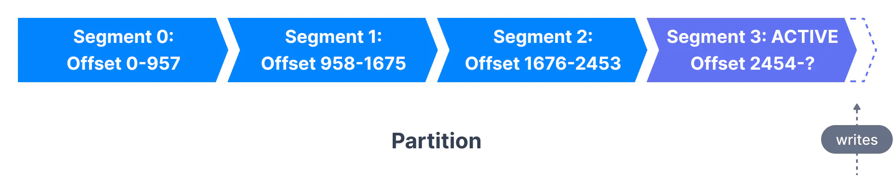
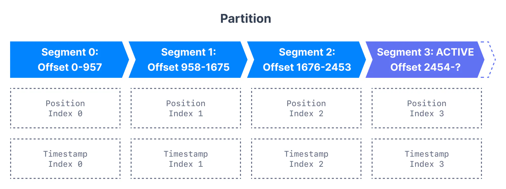
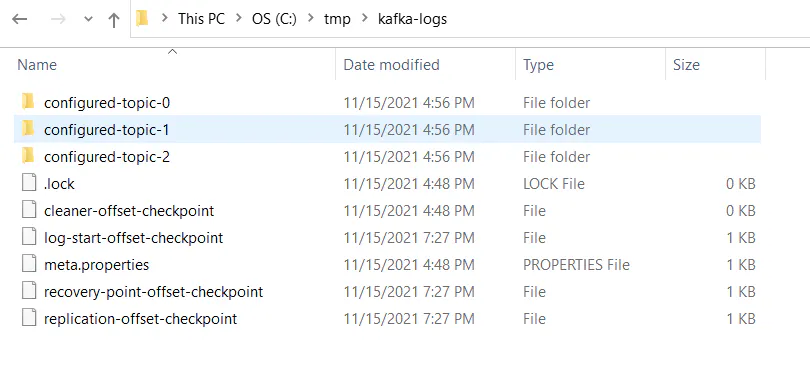
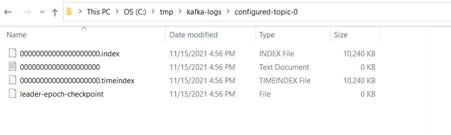

In this section, we'll take a deep dive into Kafka Internals and learn how Kafka handles topic storage with segments and indexes. Knowing the internals provides context when troubleshooting or trying to understand why Kafka behaves the way it does, and also helps you set configuration parameters.

## Kafka Topic Partitions and Segments

The basic storage unit of Kafka is a partition replica. When you create a topic, Kafka first decides how to allocate the partitions between brokers. It spreads replicas evenly among brokers.

Kafka brokers splits each partition into **segments**. Each segment is stored in a single data file on the disk attached to the broker. By default, each segment contains either 1 GB of data or a week of data, whichever limit is attained first. When the Kafka broker receives data for a partition, as the segment limit is reached, it will close the file and start a new one:

Kafka Topic Partitions & Segments

Only one segment is ACTIVE at any point in time - the one data is being written to. A segment can only be deleted if it has been closed beforehand. The size of a segment is controlled by two Broker configurations ([which can be modified at the topic level too](https://www.conduktor.io/kafka/kafka-topic-configuration-log-retention/))

- **log.segment.bytes:** the max size of a single segment in bytes (default 1 GB)

- **log.segment.ms:** the time Kafka will wait before committing the segment if not full (default 1 week)

A Kafka broker keeps an open file handle to every segment in every partition - even inactive segments. This leads to a usually high number of open file handles, and the OS must be tuned accordingly.

Kafka allows consumers to start fetching messages from any available offset. In order to help brokers quickly locate the message for a given offset, Kafka maintains two indexes for each segment:

- An offset to position index - It helps Kafka know what part of a segment to read to find a message

- A timestamp to offset index - It allows Kafka to find messages with a specific timestamp

Kafka Topic Segments and Indexes

## Inspecting the Kafka Directory Structure

Kafka stores all of its data in a directory on the broker disk. This directory is specified using the property `log.dirs` in the broker's configuration file. For example,

`1 2` `# A comma separated list of directories under which to store log files log.dirs=/tmp/kafka-logs`

Explore the directory and notice that there is a folder for each topic partition. All the segments of the partition are located inside the partition directory. Here, the topic named `configured-topic` has three partitions, each having one directory - `configured-topic-0`, `configured-topic-1` and `configured-topic-2`.

Kafka log.dirs

Descend into a directory for a topic partition. Notice the indexes - time and offset for the segment and the segment file itself where the messages are stored.

Kafka Topic Segment Indexes

## Considerations for Segment Configurations

Let us review the configurations for segments and learn their importance.

- `**log.segment.bytes**` As messages are produced to the Kafka broker, they are appended to the current segment for the partition. Once the segment has reached the size specified by the `log.segment.bytes` parameter, which defaults to 1 GB, the segment is closed and a new one is opened.
  
  - A smaller segment size means that files must be closed and allocated more often, which reduces the overall efficiency of disk writes.
  
  - Once a segment has been closed, it can be considered for expiration. Adjusting the size of the segments can be important if topics have a low produce rate. Having a small segment size would mean Kafka has to keep a lot of files open which may lead to **Too many open files** error**.**

- **`log.segment.ms`** Another way to control when segments are closed is by using the `log.segment.ms` parameter, which specifies the amount of time after which a segment should be closed. The default is 1 week. Kafka will close a segment either when the size limit is reached or when the time limit is reached, whichever comes first.
  
  - When using a time-based segment limit, it is important to consider the impact on disk performance when multiple segments are closed simultaneously.
  
  - Decide if you want [daily compaction](https://www.conduktor.io/kafka/kafka-topic-configuration-log-compaction/) instead of weekly

In the next page we will configure Kafka Log Retention.