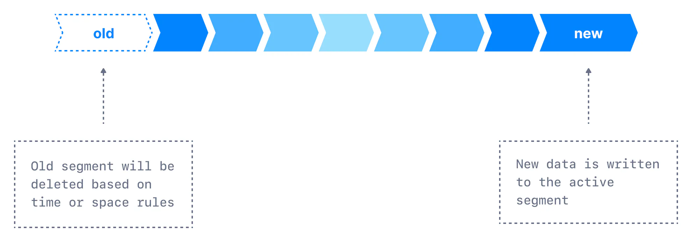

In this section, we'll learn about the options available to delete old log segments in Kafka. You can [learn all about log segments here](https://www.conduktor.io/kafka/kafka-topics-internals-segments-and-indexes/).

We learned earlier that many of the topic configurations have a default specified in the broker configuration, which will apply unless an override is set. The broker configurations to control the log cleaning delete policy are:

- `**log.retention.hours**`
  
  The most common configuration for how long Kafka will retain messages is **by time**. The default is specified in the configuration file using the `log.retention.hours` parameter, and it is set to **168 hours, the equivalent of one week**.
  
  Setting it to a higher value will result in more disk space being used on brokers for that particular topic. On the other hand, setting it to a very small value will make data available for less time. Consumers that are not available for a long time may miss the data.
  
  There are two other parameters allowed, `log.retention.minutes` and `log.retention.ms`. All three of these specify the same configuration - the amount of time after which messages may be deleted. If more than one is specified, the smaller unit size will take precedence.
  
  Because the Kafka CLI command only allows you to set the `ms` version of this parameter, so we recommend using that one across all your configurations.

- `**log.retention.bytes**`
  
  Another way to expire messages is based on the total number of bytes of messages retained. This value is set using the `log.retention.bytes` parameter, and it is applied **per partition**.
  
  The default is **\-1**, meaning that there is no limit and only a time limit is applied. This parameter is useful to set a to positive value if you want to keep the size of a log under a threshold.

One can mix the retention in bytes and in hours to ensure the log is never older than a certain amount of time and never larger than a certain size. This all depends on your use case and storage requirements.

Broker-level vs Topic-level

Kafka broker-level topic configurations are prefixed by `log.` and we can remove it to find the equivalent Kafka topic-level configuration

It is important to note these are minimum guarantees, not hard limits. The active segment does not count toward the Byte limit, and the Time limit can be much greater than expected if the segment is very big (few messages per day in a 1GB segment).

## Configuring Retention by Size and Time

We learned earlier that new data gets appended into the active segment. Retention by time is performed by examining the last modified time on each log segment file on disk. This is the time that the log segment was closed, and represents the timestamp of the last message in the file.

Log Retention by Size and Time

If you have specified a value for both `log.retention.bytes` and `log.retention.hours`, messages may be removed when either criteria is met.

Let us see how we can implement two common use-cases with these parameters.

1. **One week of retention**
   
   To specify retention by time, we have to set `log.retention.hours` to one week. We have also to make sure the data is not expired by size. So, configure the values as shown:
   
   `retention.ms = 604800000`
   
   `retention.bytes = -1`

2. **Infinite time retention bounded by 500MB**
   
   We have to set `retention.bytes` to `500MB`. We have also to make sure the data is not expired by time. This can be achieved by setting it to the special \`-1\` value. So, configure the values as shown:
   
   `retention.ms = -1`
   
   `retention.bytes = 524288000`

## Example command

To set these configurations, the following command will help:

`1` `kafka-configs.sh --bootstrap-server localhost:9092 --alter --entity-type topics --entity-name configured-topic --add-config retention.ms=-1,retention.bytes=524288000`