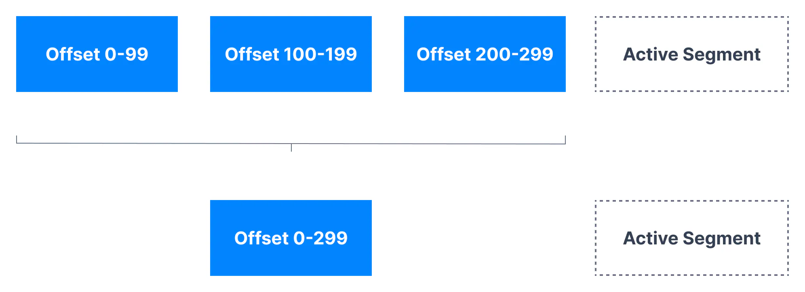

In this page you will find a long theory section on how log compaction works and then you will find at the bottom some practice to make sense of it all. It can be helpful to jump back into the theory after doing the practice!

___

## Kafka Log Cleanup Policies

Kafka stores messages for a set amount of time and purge messages older than the retention period. This expiration happens due to a policy called `**log.cleanup.policy**`. There are two cleanup policies:

- `**log.cleanup.policy=delete**`
  
  This is the default for all the user topics. With this policy configured for a topic, Kafka deletes events older than the configured retention time. The default retention period is a week. Log Cleanup Policy delete has [already been discussed here](https://www.conduktor.io/kafka/kafka-topic-configuration-log-retention/).

- `**log.cleanup.policy=compact**`
  
  This policy is the default for Kafka's `__consumer_offsets` topic. With this policy on a topic, Kafka only stores the most recent value for each key in the topic. Setting the policy to compact only makes sense on topics for which applications produce events that contain both a key and a value.

### Purpose of Log Cleanup

Kafka was not initially meant to keep data forever (although now some people are going in that direction with large disks or [Tiered Storage](https://cwiki.apache.org/confluence/display/KAFKA/KIP-405%3A+Kafka+Tiered+Storage)), nor does it wait for all consumers to read a message before deleting it. By configuring a retention policy for each topic, it allows administrators to:

- Control the size of the data on the disk and delete obsolete data

- Limit maintenance work on the Kafka Cluster

- Limit the amount of historical data a consumer may have to consume to catch up on the topic

### Kafka Log Cleanup frequency

Log cleanup happens on the partition segments. Segments divide partition data into smaller files that can be managed better and cleaned independently.

Cleanup should happen often enough to ensure the files are deleted, but not so often as to affect the broker and disk performance. Smaller log retention sizes might require more frequent checks.

___

As we learned in the section on **Kafka Log Cleanup Policies**, Kafka will store messages for a set amount of time and purge messages older than the retention period. However, imagine a case where Kafka is used for storing the salary information about all the employees in a company. In that case, it makes sense to store only the latest salary for each employee rather than the historical data for a limited period of time.

Kafka supports such use cases by allowing the retention policy on a topic to be set to `compact`, **with the property to only retain at least the most recent value for each key in the partition**. It is very useful if we just require a SNAPSHOT instead of full history.

### Kafka Log Compaction Example

We want to keep the most recent salary for our employees. We create a topic named `employee-salary` for the purpose. We don't want to know about the old salaries of the employees.

Kafka Log Compaction Example

Applications producing these events should contain both a key and a value. The key, in this case, will be employee id, and the value will be their salary. As the data comes in, it will be appended into segments of a partition. After compaction, a new segment is created with only the latest events for a key being retained. The older events for that key are deleted, the offset of the messages are kept intact.

### Kafka Log Compaction Guarantees

There are some important guarantees that Kafka provides for messages produced on the log-compacted topics.

- Any consumer that is reading from the tail of a log, i.e., the most current data, will still see all the messages sent to the topic. It does not matter whether a topic is log-compacted or not, consumers subscribed to the topic will see messages as they are produced on the topic.

- Ordering of messages at the key level and partition level is kept, log compaction only removes some messages, but does not re-order them. The offsets are kept, only some messages are deleted.

- The offset of a message is immutable (it never changes). Offsets are just skipped if a message is missing

- Deleted records can still be seen by consumers for a period of `log.cleaner.delete.retention.ms` (default is 24 hours). This gives some heads-up time for the consumers to catch up on the messages that will be deleted.

### Kafka Log Compaction Myth Busting

Let us look at some of the misconceptions around log compaction and clear them.

- **It doesn’t prevent you from pushing duplicate data to Kafka.**
  
  De-duplication is done after a segment is committed. Your consumers will still read from the tail of a log segment as soon as the data arrives. It is not a way to perform de-duplication of messages.

- **It doesn’t prevent you from reading duplicate data from Kafka.**
  
  If a consumer re-starts, it may see duplicate data, based on the at-least-once reading semantics we have seen before.

Log Compaction & API Calls

You can’t trigger **Log Compaction** using an API call at present, as it happens in the background automatically if enabled.

### How Kafka Log Compaction Works

If compaction is enabled when Kafka starts, each broker will start a compaction manager thread and a number of compaction threads. These are responsible for performing the compaction tasks.

Kafka Log Compaction Cleaner Threads

- Cleaner threads start with the oldest segment and check their contents. The active segments are left untouched by the cleaner threads.

- If the message it has just read is still the latest for a key, it copies over the message to a replacement segment. Otherwise it omits the message because there is a message with an identical key but a newer value later in the partition.

- Once the cleaner thread has copied over all the messages that still contain the latest value for their key, we swap the replacement segment for the original and move on to the next segment.

- At the end of the process, we are left with one message per key - the one with the latest value.

Ordering Intact

The important thing to note here is that new segments are created/combined from old segments after the cleaner thread has done its work. The offsets are left untouched and the key-based ordering as well.

### Log Compaction Configurations

Log compaction is configured by the broker configuration `log.cleanup.policy=compact`. There are other configurations that impact how often log compaction takes place.

- **`log.cleaner.enable`** if you want to disable log compaction (not recommended, and it will affect your `__consumer_offsets` topic). Disable temporarily if needed

- **`log.cleaner.threads`** The number of background threads to use for log cleaning

- **`log.segment.ms`** (default 7 days): Max amount of time to wait to close an active segment

- `**log.segment.bytes**` (default 1G): Max size of a single metadata log file

- **`log.cleaner.delete.retention.ms`** (default 24 hours): Controls how long delete records and transaction markers are retained after they are eligible for deletion. This is used to ensure that consumers which are concurrently reading the log have an opportunity to read these records before they are removed.

- **`log.cleaner.backoff.ms`**:(default 15 seconds) The amount of time to sleep when there are no logs to clean (default is 15 seconds)

- `**log.cleaner.min.compaction.lag.ms**` (default 0): This can be used to prevent messages newer than a minimum message age from being subject to compaction. If not set, all log segments are eligible for compaction except for the last segment, i.e. the one currently being written to. The active segment will not be compacted even if all of its messages are older than the minimum compaction time lag. The log cleaner can be configured to ensure a maximum delay after which the uncompacted "head" of the log becomes eligible for log compaction.

- **`log.cleaner.max.compaction.lag.ms`** (default infinite): This can be used to prevent log with low produce rate from remaining ineligible for compaction for an unbounded duration. If not set, logs that do not exceed min.cleanable.dirty.ratio are not compacted. Note that this compaction deadline is not a hard guarantee since it is still subjected to the availability of log cleaner threads and the actual compaction time. You will want to monitor the uncleanable-partitions-count, max-clean-time-secs and max-compaction-delay-secs metrics.

- **`min.cleanable.dirty.ratio`** (default 0.5): The minimum ratio of dirty log to total log for a log to be eligible for cleaning. If the `log.cleaner.max.compaction.lag.ms` or the `log.cleaner.min.compaction.lag.ms` configurations are also specified, then the log compactor considers the log eligible for compaction as soon as either: (i) the dirty ratio threshold has been met and the log has had dirty (uncompacted) records for at least the `log.cleaner.min.compaction.lag.ms` duration, or (ii) if the log has had dirty (uncompacted) records for at most the `log.cleaner.max.compaction.lag.ms` period.

### Log compaction tombstones

Compaction also allows for deletes. A message with a key and a `null` payload will be treated as a delete from the log. Such a record is sometimes referred to as a tombstone. This delete marker will cause any prior message with that key to be removed (as would any new message with that key), but delete markers are special in that they will themselves be cleaned out of the log after a period of time to free up space.

Any consumer progressing from the start of the log will see at least the final state of all records in the order they were written. Additionally, all delete markers for deleted records will be seen, provided the consumer reaches the head of the log in a time period less than the topic's delete.retention.ms setting (the default is 24 hours). In other words: since the removal of delete markers happens concurrently with reads, it is possible for a consumer to miss delete markers if it lags by more than `delete.retention.ms`.

___

## Log Compaction Practice

We want to keep the most recent salary for our employees. We create a topic named `employee-salary` for this purpose. We don't want to know about the old salaries of the employees.

Kafka Log Compaction Example

Windows Users: you can't use log compaction if you're not using WSL2

Windows has a long-standing bug (KAFKA-1194) that makes Kafka crash if you use log cleaning. The only way to recover from the crash is to manually delete the folders in `log.dirs` directory.

Create a log-compacted topic named `employee-salary` with a single partition and a replication factor of 1. Use Kafka topics CLI and pass appropriate configs as shown below.

- Number of partitions=1. This is to ensure all messages go the same partition.

- `cleanup.policy=compact`. This enables log compaction for the topic.

- `min.cleanable.dirty.ratio=0.001`. This is just to ensure log cleanup is triggered always.

- `segment.ms=5000`. New segment will be created every 5 seconds. Log compaction will happen on closed segments only

`1 2 3 4 5` `kafka-topics.sh --bootstrap-server localhost:9092 --create --topic employee-salary \ --partitions 1 --replication-factor 1 \ --config cleanup.policy=compact \ --config min.cleanable.dirty.ratio=0.001 \ --config segment.ms=5000`

Describe the topic to make sure the configurations have been applied correctly.

`1 2` `kafka-topics.sh --bootstrap-server localhost:9092 --describe \ --topic employee-salary`

Start a Kafka console consumer.

Use the following command to show both the key and value, separated by a comma.

`1 2 3 4 5` `kafka-console-consumer.sh --bootstrap-server localhost:9092 \ --topic employee-salary \ --from-beginning \ --property print.key=true \ --property key.separator=,`

Launch another shell to create a Kafka console producer. We want to send keys for the messages. The separator between the key and the value is a comma.

`1 2 3 4` `kafka-console-producer.sh --bootstrap-server localhost:9092 \ --topic employee-salary \ --property parse.key=true \ --property key.separator=,`

Produce a few messages with duplicate keys. In the first message shown below, the key is `Mark` and the value is `salary: 1000`.

`1 2 3 4 5 6` `Patrick,salary: 10000 Lucy,salary: 20000 Bob,salary: 20000 Patrick,salary: 25000 Lucy,salary: 30000 Patrick,salary: 30000`

Wait a minute, and produce a few more messages (it could be the same messages)

Stop the Kafka console consumer and start a new one. We are fetching all the messages from the beginning. **We'll see only the unique keys with their corresponding latest values.**

`1 2 3 4` `Bob,salary: 20000 Lucy,salary: 30000 Patrick,salary: 30000 Stephane,salary: 0`

Log compaction will take place in the background automatically. We cannot trigger it explicitly. However, we can control how often it is triggered with the log compaction properties.