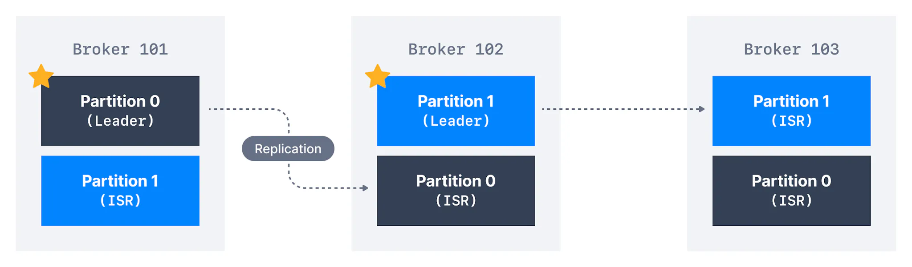

When creating a topic, we have to provide a partition count and the replication factor. These two are very important to set correctly as they impact the performance and durability in the system. Starting with one set of values and changing them later will have an adverse impact on the system as depicted below.

- If the partitions count increases during a topic lifecycle, you will break your keys ordering guarantees

- If the replication factor increases during a topic lifecycle, you put more pressure on your cluster, which can lead to an unexpected performance decrease due to more network traffic and additional space used on your brokers. Proceed with caution

Adding replicas uses more space and adds more network traffic

Right First Time

It is best to get the partition count and replication factor right the first time!

The number of partitions per topic is a million-dollar question and there’s no one answer. In this section, we'll learn a few rules of thumb guidelines that will help us set these parameters correctly.

## How to choose the number of partitions in a Kafka topic

There are several factors to consider when choosing the number of partitions:

- What is the maximum throughput (in MB/s) you expect to achieve when consuming from a single partition? Measure it for your environment.

- If you are sending messages to partitions based on keys, adding partitions later can be very challenging, so calculate throughput based on your expected future usage.

- Having more partitions has advantages. It implies:
  
  - Better parallelism and better throughput. A partition is a unit of parallelism, so creating more partitions implies more parallelism.
  
  - It also gives us the ability to run more consumers in a group to scale. For example, if we have 3 partitions, we can have at most 3 consumers active, others will remain inactive.
  
  - If the cluster contains a high number of brokers, having more partitions will leverage these brokers. For example, if you have a topic with 2 partitions, they can be hosted on two brokers only, and the other brokers will remain idle which is an inefficient usage of resources.

- However, there are downsides to having more partitions (which are slowly disappearing)
  
  - Each partition will have a partition leader to be elected by Zookeeper. Hence there will be more load on Zookeeper which will increase the time for leader elections.
  
  - This problem is going to be solved in a Zookeeper-less Kafka, which can you can [learn about here](https://www.conduktor.io/kafka/kafka-kraft-mode/) and [practice while starting Kafka](https://www.conduktor.io/kafka/starting-kafka/).
  
  - More files opened by Kafka. There is an OS limit to the number of files that can be opened, although you can and should change it to a high value on your OS settings.

With all this in mind, the following are a few guidelines that will help you choose wisely.

- If you have a **small cluster of fewer than 6 brokers**, create **three times, i.e., 3X,** the number of brokers you have. The reasoning behind it is that if you have more brokers over time, you will have enough partitions to cover that.

- If you have a **big cluster of over 12 brokers**, create **two times i.e.**, **2X,** the number of brokers you have.

- You also want to take into account the **number of consumers** you need to run in a group at the desired peak throughput. If, for example, you need 20 consumers at peak time, you need at least 20 partitions in your topic, regardless of the size of your cluster.

- You also need to consider the **producer throughput**. If you have a high throughput producer or if it is going to increase in the next couple of years, keep the partition count to **3 times the number of brokers**.

It is good to have a high number of partitions per topic, but do not pick an absurdly high number like 1000 unless you know you will need all these partitions.

## How to choose the replication factor of a Kafka topic?

To increase the reliability and fault tolerance, replications of the partitions are necessary. Remember that topic replication does not increase the consumer parallelism. The factors to consider while choosing replication factor are:

- It should be at least 2 and a maximum of 4. The recommended number is 3 as it provides the right balance between performance and fault tolerance, and usually cloud providers provide 3 data centers / availability zones to deploy to as part of a region.

- The advantage of having a higher replication factor is that it provides a better resilience of your system. If the replication factor is `N`, up to `N-1` broker may fail without impacting availability if `acks=0` or `acks=1` or `N-min.insync.replicas` brokers may fail if `acks=all`

- The disadvantages of having a higher replication factor:
  
  - Higher latency experienced by the producers, as the data needs to be replicated to all the replica brokers before an ack is returned if `acks=all`
  
  - More disk space required on your system

With all this in mind, the following are a few guidelines that will help you choose wisely.

- **Set it to 3** to get started (you must have at least 3 brokers for that)

- If there is a performance issue due to a higher replication factor, you should get a better broker instead of lowering the replication factor.

- Never set it to 1 in production, as it means no fault tolerance. If the partition is lost, you will have data loss.

- [Review the part](https://www.conduktor.io/kafka/kafka-topic-configuration-min-insync-replicas/) around `acks` mechanism and `min.insync.replicas` to understand the implication of these settings on your replication factor.

## Cluster guidelines

The appropriate size for a Kafka cluster is determined by several factors. Following are some general guidelines:

- A Kafka cluster should have a **_maximum of_** [**_200,000 partitions_**](https://blogs.apache.org/kafka/entry/apache-kafka-supports-more-partitions) across all brokers when managed by Zookeeper. The reason is that if brokers go down, Zookeeper needs to perform **_a lot_** **of** **_leader elections_**. Confluent still recommends up to 4,000 partitions per broker in your cluster.

- This problem should be solved by Kafka in a Zookeeper-less mode ([Kafka KRaft](https://www.conduktor.io/kafka/kafka-kraft-mode/))

- If you need more than 200,000 partitions in your cluster, follow the **_Netflix model_** and create more Kafka clusters

Testing. Testing.

Start at a reasonable number and test the performance