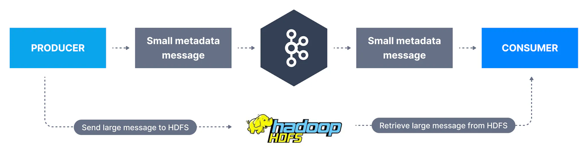

Kafka has a default limit of 1MB per message in the topic. This is because very large messages are considered inefficient and an anti-pattern in Apache Kafka.

Yet, you may need to send large messages in Apache Kafka.

There are two approaches to sending large messages in Apache Kafka:

___

## Option 1: using an external store (GB-size messages)

Modify your client to send large messages (example video files) outside of Kafka and only send to Kafka a reference to these message. This involves extra logic on your end but could prove quite efficient.

The store of your large message could be a cloud store such as Amazon S3, or an on-premise large file storage system such as a network system or HDFS.

To date there is no library that exists that performs this functionality out of the box, but it shouldn't be too complicated to engineer. Ensure you have written both a custom producer and consumer.

___

## Option 2: sending larger messages to Kafka (ex less than 10MB but over 1MB)

Here we need to modify topic, producer and consumer configurations to allow for a bigger message size.

### Broker Side

It is recommended to leave the max message size default for the Kafka brokers and only override this at the topic level through topic-level configurations.

Confusing setting

The broker-side setting is `message.max.bytes`and the topic-side setting is `max.message.bytes`

Let's create a topic named `large-message`

`1` `kafka-topics.sh --bootstrap-server localhost:9092 --create --topic large-message --partitions 3 --replication-factor 1`

And add the necessary `max.message.bytes` configuration for 10MB

`1 2 3 4` `kafka-configs.sh --bootstrap-server localhost:9092 \ --alter --entity-type topics \ --entity-name configured-topic \ --add-config max.message.bytes=10485880`

Now our topic is created and configured to receive large messages, but this is not enough/

You must also set the setting `replica.fetch.max.bytes=10485880` so that your brokers can replicate the large messages correctly. This setting can only be set in the Kafka config files `server.properties` and must require a broker restart.

### Consumer Side

You must also change the `max.partition.fetch.bytes` configuration on the consumer side and your consumer clients. If this value is smaller than `message.max.bytes` the consumer will fail to fetch these messages and will get stuck on processing, which is very undesirable.

To set this in your CLI, you can use `--consumer-property`:

`1 2 3 4` `kafka-console-consumer.sh --bootstrap-server localhost:9092 \ --topic large-message \ --from-beginning \ --consumer-property max.partition.fetch.bytes=10485880`

Or in your Java code:

`1` `properties.setProperty(ConsumerConfig.FETCH_MAX_BYTES_CONFIG, "10485880");`

### Producer Side

You must change the property `max.request.size` producer-side to ensure large messages can be sent.

To set this in your CLI, you can use `--producer-property`:

`1 2 3` `kafka-console-producer.sh --bootstrap-server localhost:9092 \ --topic large-message \ --producer-property max.request.size=10485880`

Or in your Java code:

`1` `properties.setProperty(ProducerConfig.MAX_REQUEST_SIZE_CONFIG, "10485880");`