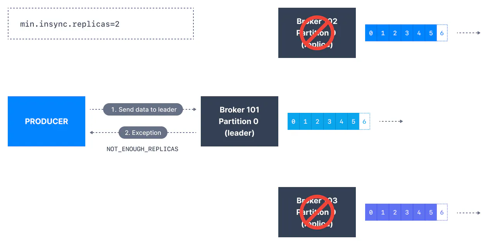

We have learned about a Kafka producer configuration parameter called `acks` which is the number of brokers who need to acknowledge receiving the message before it is considered a successful write. We use another Kafka configuration `min.insync.replicas` along with this producer configuration.

## Kafka producers acks setting

Kafka producers only write data to the current leader broker for a partition.

Kafka producers must also specify a level of acknowledgment `acks` to specify if the message must be written to a minimum number of replicas before being considered a successful write.

The default value of acks has changed with Kafka v3.0

- if using Kafka < v3.0, `acks=1`

- if using Kafka >= v3.0, `acks=all`

#### acks=0

When `acks=0` producers consider messages as "written successfully" the moment the message was sent without waiting for the broker to accept it at all.

acks = 0

If the broker goes offline or an exception happens, we won’t know and will lose data. This is useful for data where it’s okay to potentially lose messages, such as metrics collection, and produces the highest throughput setting because the network overhead is minimized.

#### acks = 1

When `acks=1` , producers consider messages as "written successfully" when the message was acknowledged by only the leader.

acks = 1

Leader response is requested, but replication is not a guarantee as it happens in the background. If an ack is not received, the producer may retry the request. If the leader broker goes offline unexpectedly but replicas haven’t replicated the data yet, we have a data loss.

### acks = all

When `acks=all`, producers consider messages as "written successfully" when the message is accepted by all in-sync replicas (ISR).

acks = all

The lead replica for a partition checks to see if there are enough in-sync replicas for safely writing the message (controlled by the broker setting `min.insync.replicas`). The request will be stored in a buffer until the leader observes that the follower replicas replicated the message, at which point a successful acknowledgement is sent back to the client.

The`min.insync.replicas` can be configured both at the topic and the broker-level. The data is considered committed when it is written to all in-sync replicas - `min.insync.replicas.` A value of 2 implies that at least 2 brokers that are ISR (including leader) must respond that they have the data.

If you would like to be sure that committed data is written to more than one replica, you need to set the minimum number of in-sync replicas to a higher value. If a topic has three replicas and you set `min.insync.replicas` to `2`, then you can only write to a partition in the topic if at least two out of the three replicas are in-sync. When all three replicas are in-sync, everything proceeds normally. This is also true if one of the replicas becomes unavailable. However, if two out of three replicas are not available, the brokers will no longer accept produce requests. Instead, producers that attempt to send data will receive `NotEnoughReplicasException`.

Kafka Topic Replication, ISR & Message Safety

## Kafka Topic Durability & Availability

For a topic replication factor of 3, topic data durability can withstand 2 brokers loss. As a general rule, for a replication factor of `N`, you can permanently lose up to `N-1` brokers and still recover your data.

Regarding availability, it is a little bit more complicated... To illustrate, let's consider a replication factor of 3:

- Reads: As long as one partition is up and considered an ISR, the topic will be available for reads.

- Writers:
  
  - `acks=0` & `acks=1` : as long as one partition is up and considered an ISR, the topic will be available for writes.
  
  - `acks=all`:
    
    - `min.insync.replicas=1` (default): the topic must have at least 1 partition up as an ISR (that includes the reader) and so we can tolerate two brokers being down.
    
    - `min.insync.replicas=2`: the topic must have at least 2 ISR up, and therefore we can tolerate at most one broker being down (in the case of replication factor of 3), and we have the guarantee that for every write, the data will be at least written twice.
    
    - `min.insync.replicas=3`: this wouldn't make much sense for a corresponding replication factor of 3 and we couldn't tolerate any broker going down.
    
    - in summary, when `acks=all` with a `replication.factor=N` and `min.insync.replicas=M` we can tolerate `N-M` brokers going down for topic availability purposes.

Popular Configuration

`acks=all` and `min.insync.replicas=2` is the most popular option for data durability and availability and allows you to withstand at most the loss of **one** Kafka broker

## Overriding Topic Configuration Defaults

Let's see how to change the configuration `min.insync.replicas` of a topic using the CLI tool `kafka-configs`. The default value of this configuration at the broker level is `1`. [As we mentioned before](https://www.conduktor.io/kafka/kafka-topic-replication/), a typical value for this configuration is the **replication factor minus 1.** This means with a replication factor of 3, `min.insync.replicas` should be 2.

CLI Extensions

Use CLI commands with appropriate extensions for your platform, e.g., `kafka-configs.bat` for windows, `kafka-configs.sh` for Linux

Before running Kafka CLIs make sure that you have [started Kafka](https://www.conduktor.io/kafka/starting-kafka/) successfully.

First, create a topic named configured-topic with 3 partitions and a replication factor of 1, using Kafka topics CLI, `kafka-topics`.

`1` `kafka-topics.sh --bootstrap-server localhost:9092 --create --topic configured-topic --partitions 3 --replication-factor 1`

Describe the topic to check if there are any configuration override set for this topic.

`1` `kafka-topics.sh --bootstrap-server localhost:9092 --describe --topic configured-topic`

`1 2 3 4` `Topic: configured-topic TopicId: CDU7SBxBQ1mzJGnuH68-cQ PartitionCount: 3 ReplicationFactor: 1 Configs: Topic: configured-topic Partition: 0 Leader: 2 Replicas: 2 Isr: 2 Topic: configured-topic Partition: 1 Leader: 3 Replicas: 3 Isr: 3 Topic: configured-topic Partition: 2 Leader: 1 Replicas: 1 Isr: 1`

There is no configuration override set.

Set the `min.insync.replicas` value for the topic `configured-topic` to 2

`1` `kafka-configs.sh --bootstrap-server localhost:9092 --alter --entity-type topics --entity-name configured-topic --add-config min.insync.replicas=2`

And describe the topic again

`1 2 3 4 5` `kafka-topics.sh --bootstrap-server localhost:9092 --describe --topic configured-topic Topic: configured-topic TopicId: CDU7SBxBQ1mzJGnuH68-cQ PartitionCount: 3 ReplicationFactor: 1 Configs: min.insync.replicas=2 Topic: configured-topic Partition: 0 Leader: 2 Replicas: 2 Isr: 2 Topic: configured-topic Partition: 1 Leader: 3 Replicas: 3 Isr: 3 Topic: configured-topic Partition: 2 Leader: 1 Replicas: 1 Isr: 1`

Now, you can see there is a topic configuration override set (at the right side of the output) - `min.insync.replicas=2`.

You can delete the configuration override by passing `--delete-config` in place of the `--add-config` flag.

`1` `kafka-configs.sh --bootstrap-server localhost:9092 --alter --entity-type topics --entity-name configured-topic --delete-config min.insync.replicas`

Describe the topic to make sure the configuration override has been removed.

## Configuring min.insync.replicas at Kafka broker level

#### Through a configuration file change

The default value of this configuration is `1`. However, this can be changed at the broker level. Open the broker configuration file `config/server.properties` and append the following at the end of the file.

Unlike using `kafka-configs` which can change configuration while the broker is running, this, however, requires a broker restart for the configuration change to take effect.

#### Dynamic Kafka Broker configuration change using the kafka-configs CLI

The `kafka-configs` CLI can also update broker configuration (on top of topic configuration) dynamically without requiring a broker restart. Here is how:

`1 2` `$ kafka-configs.sh --bootstrap-server localhost:9092 --alter --entity-type brokers --entity-default --add-config min.insync.replicas=2 Completed updating default config for brokers in the cluster.`

And then if we describe the dynamically updated configurations for our brokers

`1 2 3` `$ kafka-configs.sh --bootstrap-server localhost:9092 --describe --entity-type brokers --entity-default Default configs for brokers in the cluster are: min.insync.replicas=2 sensitive=false synonyms={DYNAMIC_DEFAULT_BROKER_CONFIG:min.insync.replicas=2}`

We can delete the dynamic configuration as well:

`1` `kafka-configs.sh --bootstrap-server localhost:9092 --alter --entity-type brokers --entity-default --delete-config min.insync.replicas`