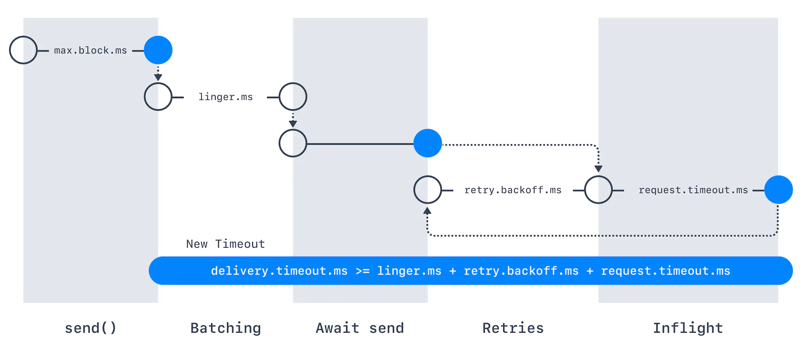

When the producer sends messages to a broker, the broker can return either a success or an error code. Those error codes belong to two categories.

- **Retriable errors**. Errors that can be resolved after retrying. For example, if the broker returns the exception `NotEnoughReplicasException`, the producer can try sending the message again - maybe replica brokers will come back online and the second attempt will succeed.

- **Nonretriable error.** Errors that won’t be resolved. For example, if the broker returns an INVALID\_CONFIG exception, trying the same producer request again will not change the outcome of the request.

It is desirable to enable retries in order to ensure that no messages are dropped when sent to Apache Kafka.

___

## Producer Retry Configurations (read all)

### In short

To have a safe retry for producers, set the following configurations:

`1 2 3 4 5` `// create safe Producer properties.setProperty(ProducerConfig.ENABLE_IDEMPOTENCE_CONFIG, "true"); properties.setProperty(ProducerConfig.ACKS_CONFIG, "all"); properties.setProperty(ProducerConfig.RETRIES_CONFIG, Integer.toString(Integer.MAX_VALUE)); properties.setProperty(ProducerConfig.MAX_IN_FLIGHT_REQUESTS_PER_CONNECTION, "5"); // kafka 2.0 >= 1.1 so we can keep this as 5. Use 1 otherwise.`

### retries

The `retries` setting determines how many times the producer will attempt to send a message before marking it as failed. The default values are:

- 0 for Kafka <= 2.0

- MAX\_INT, i.e., 2147483647 for Kafka >= 2.1

Users should generally prefer to leave this config unset and instead use `delivery.timeout.ms` to control retry behavior.

### delivery.timeout.ms

If `retries > 0`, for example, `retries = 2147483647`, the producer won’t try the request forever, it’s bounded by a timeout. For this, you can set an intuitive Producer Timeout ([KIP-91 – Kafka 2.1](https://cwiki.apache.org/confluence/display/KAFKA/KIP-91+Provide+Intuitive+User+Timeouts+in+The+Producer)) such as `delivery.timeout.ms=120000` (= 2 minutes). Records will be failed if they can’t be delivered in `delivery.timeout.ms`

### retry.backoff.ms

By default, the producer will wait `100ms` between retries, but you can control this using the `retry.backoff.ms` parameter.

### max.in.flight.requests.per.connection

Allowing retries without setting `max.in.flight.requests.per.connection` to 1 will potentially change the ordering of records because if two batches are sent to a single partition, and the first fails and is retried but the second succeeds, then the records in the second batch may appear first. If you rely on key-based ordering, that can be an issue. By limiting the number of in-flight requests to `1` (default being `5)`, i.e., `max.in.flight.requests.per.connection = 1,` we can guarantee that Kafka will preserve message order in the event that some messages will require multiple retries before they are successfully acknowledged.

Safety vs Throughput

Setting `max.in.flight.requests.per.connection=1`can significantly decrease your throughput

**VERY important:** if we enable idempotence `enable=idempotence=true`, then it is required for `max.in.flight.requests.per.connection` to be less than or equal to 5 **with message ordering preserved for any allowable value!!**