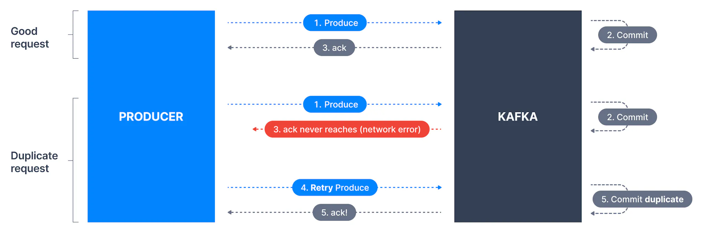
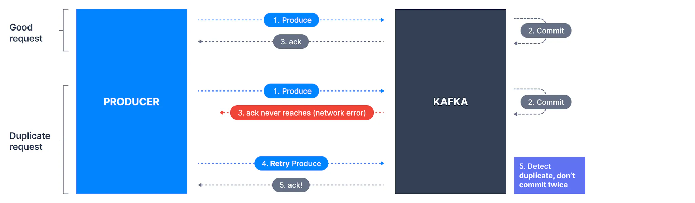

## Problem with Retries

Retrying to send a failed message often includes a small risk that both messages were successfully written to the broker, leading to duplicates. This can happen as illustrated below.

1. Kafka producer sends a message to Kafka

2. The message was successfully written and replicated

3. Network issues prevented the broker acknowledgment from reaching the producer

4. The producer will treat the lack of acknowledgment as a temporary network issue and will retry sending the message (since it can’t know that it was received).

5. In that case, the broker will end up having the same message twice.

Duplicate Messages

### Kafka Idempotent Producer

Version Availability

Producer idempotence can be enabled for Kafka versions >= 0.11

Producer idempotence ensures that duplicates are not introduced due to unexpected retries.

Idempotent Producer

#### **How does it work internally? (for the curious)**

When `enable.idempotence` is set to `true`, each producer gets assigned a **Producer Id (PID)** and the PIDis included every time a producer sends messages to a broker. Additionally, each message gets a monotonically increasing **sequence number** (different from the offset - used only for protocol purposes)**.** A separate sequence is maintained for each topic partition that a producer sends messages to. On the broker side, on a per partition basis, it keeps track of the largest PID-Sequence Number combination that is successfully written. When a lower sequence number is received, it is discarded.

## How should Kafka producer idempotence be enabled?

Now the Default

**Starting with Kafka 3.0**, producer are by default having `enable.idempotence=true` and `acks=all`. See [KIP-679](https://cwiki.apache.org/confluence/display/KAFKA/KIP-679%3A+Producer+will+enable+the+strongest+delivery+guarantee+by+default) for more details.

If you already use `acks=all` then you should enable this feature. All you need to do to turn this feature on is use the producer configuration `enable.idempotence=true`_._

`1 2 3 4` `// create Producer properties Properties properties = new Properties(); properties.setProperty(ProducerConfig.ENABLE_IDEMPOTENCE_CONFIG, "true");`

Overall, we recommend to enable producer idempotence for all your Kafka Producers. If you are not using the Java SDK by default, ensure your client library has support for this feature!

###### Was this content helpful?