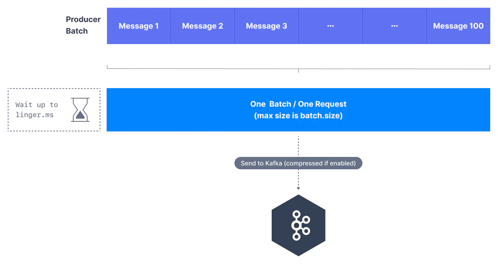

By default, Kafka producers try to send records as soon as possible. A producer will have up to 5 requests in flight (controlled by the `max.in.flight.requests.per.connection` setting), meaning up to 5 message batches will be sent at the same time. After this, if more messages have to be sent while others are in flight, Kafka producers are smart and producers will start batching messages while the previous message requests are finishing.

This smart batching allows Kafka to increase throughput while maintaining very low latency. Batches have a higher compression ratio so a better disk and networking efficiency. Batching is mainly controlled by two producer settings - `linger.ms` and `batch.size`.

## linger.ms and batch.size

`linger.ms` is the number of milliseconds a producer is willing to wait before sending a batch out. The default value is 0, which means "send the messages right away".

Kafka Producer Batching

By introducing some lag (for example `linger.ms=20`), we increase the chances of messages being sent together in a batch. So at the expense of introducing a small delay, we can increase the throughput, compression, and efficiency of our producer. If a batch reaches its maximum size (controlled by `batch.size`) before the end of the `linger.ms` period, it will be sent to Kafka right away!

`batch.size` is the maximum number of bytes that will be included in a batch.

The default is `16KB`. Increasing a batch size to `32KB` or `64KB` can help increase the compression, throughput, and efficiency of requests. Any message that is bigger than the batch size will not be batched. A batch is allocated per partition, so make sure that you don’t set it to a number that’s too high, otherwise you may run into high memory usages!

Key Takeaways

- Increase `linger.ms` and the producer will wait a few milliseconds for the batches to fill up before sending them.

- If you are sending full batches and have memory to spare, you can increase `batch.size` and send larger batches.

A high throughput producer may have the following configurations

`1 2 3 4` `// high throughput producer (at the expense of a bit of latency and CPU usage) properties.setProperty(ProducerConfig.COMPRESSION_TYPE_CONFIG, "snappy"); properties.setProperty(ProducerConfig.LINGER_MS_CONFIG, "20"); properties.setProperty(ProducerConfig.BATCH_SIZE_CONFIG, Integer.toString(32*1024)); // 32 KB batch size`