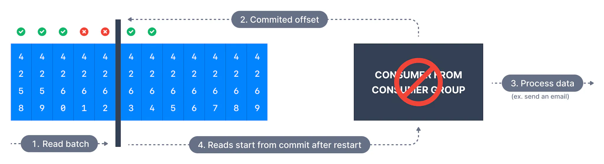
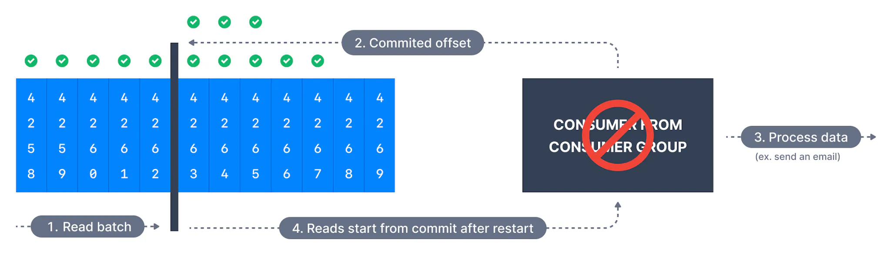
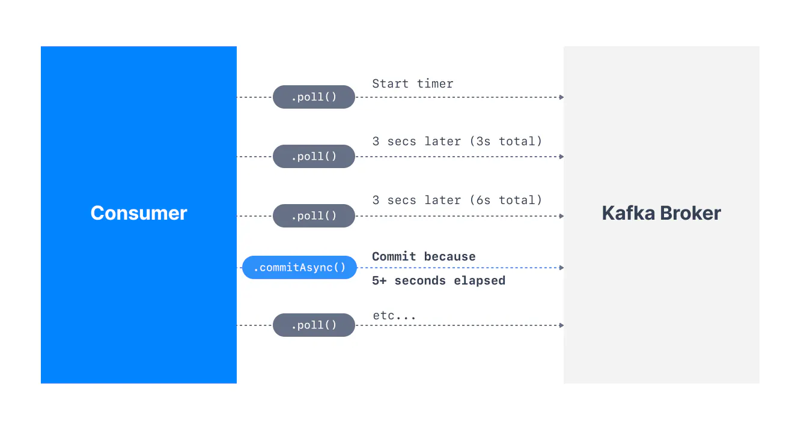

A consumer reading from a Kafka partition may choose when to commit offsets. That strategy impacts the behaviors if messages are skipped or read twice upon a consumer restart. These behaviors are discussed on this page.

## At Most Once Delivery

In this case, offsets are committed as soon as a message batch is received after calling `poll()`. If the subsequent processing fails, the message will be lost. It will not be read again as the offsets of those messages have been committed already. This may be suitable for systems that can afford to lose data.

The sequence of steps is illustrated below.

At Most Once

## At Least Once Delivery (usually preferred)

In at-least-once delivery, every event from the source system will reach its destination, but sometimes retries will cause duplicates. Here, offsets are committed after the message is processed. If the processing goes wrong, the message will be read again. This can result in duplicate processing of messages. This is suitable for consumers that cannot afford any data loss.

Idempotent Processing

Make sure your processing is idempotent (i.e. processing again the messages won’t impact your systems)

## Exactly Once Delivery

Some applications require not just at-least-once semantics (meaning no data loss), but also exactly-once semantics. Each message is delivered exactly once. This may be achieved in certain situations if Kafka and the consumer application cooperate to make exactly-once semantics happen.

- This can only be achieved for Kafka topic to Kafka topic workflows using the transactions API. The Kafka Streams API simplifies the usage of that API and enables exactly once using the setting `processing.guarantee=exactly.once`

- For Kafka topic to External System workflows, to _effectively_ achieve exactly once, you must use an idempotent consumer.

## Summary

- **At most once:** offsets are committed as soon as the message is received. If the processing goes wrong, the message will be lost (it won’t be read again).

- **At least once:** offsets are committed after the message is processed. If the processing goes wrong, the message will be read again. This can result in duplicate processing of messages. Make sure your processing is idempotent (i.e. processing again the messages won’t impact your systems)

- **Exactly once:** Can be achieved for Kafka => Kafka workflows using high-level Kafka Streams API, or the lower level Kafka Transactions API. For Kafka => Sink workflows, use an idempotent consumer.

Bottom Line

For most applications you should use **'At Least Once'** processing and ensure your transformations / processing are idempotent.

___

## Automatic Offset Committing Strategy

Using the Kafka Consumer Java API, offsets are committed regularly and automatically in order to enable at at-least once reading scenario.

You can get a refresher on [Consumer Offsets here](https://www.conduktor.io/kafka/kafka-consumer-groups-and-consumer-offsets/).

By default, the property `enable.auto.commit=true` and therefore offsets are committed automatically with a frequency controlled by the config `auto.commit.interval.ms`.

The process of committing the offsets happens when:

- the `.poll()` function is called

- AND the time between two calls to `.poll()` is greater than the setting `auto.commit.interval.ms` (5 seconds by default).

This means that to be in an "at-least-once" processing use case (the most desirable one), you need to ensure all the messages in your consumer code are successfully processed before performing another `.poll()` call (which is the case in the sample code defined above). If this is not the case, then offsets could be committed before the messages are actually processed, therefore resulting in an "at-most once" processing pattern, possibly resulting in message skipping (which is undesirable).

In that (rare) case, you must disable `enable.auto.commit`, and most likely most processing to a separate thread, and then from time to time call `.commitSync()` or `.commitAsync()`with the correct offsets manually.

This complicated use case is discussed in the [Kafka Consumer Documentation](https://kafka.apache.org/30/javadoc/org/apache/kafka/clients/consumer/KafkaConsumer.html) under the section "Automatic Offset Committing".