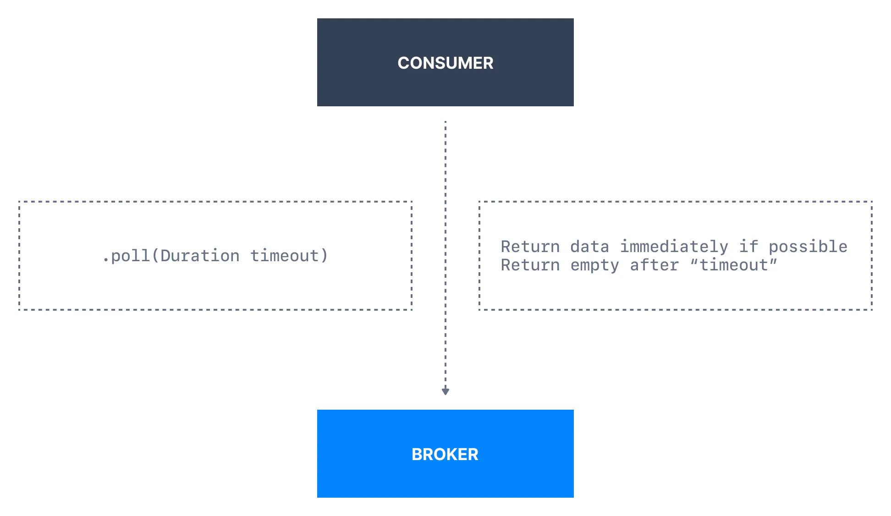
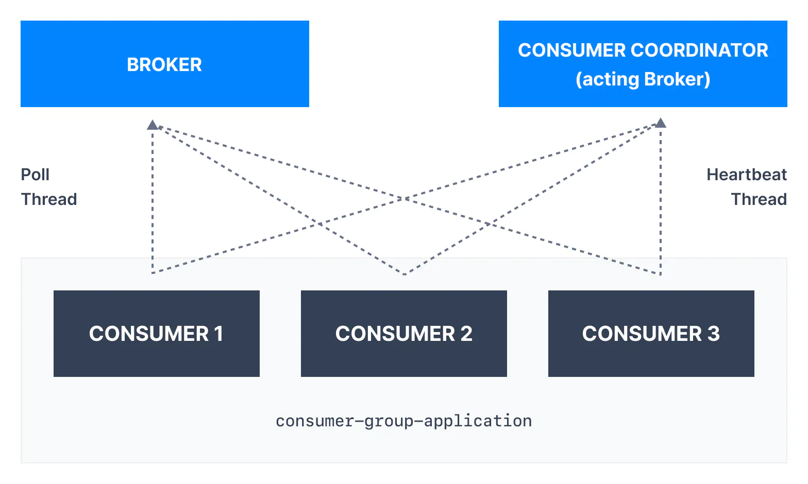

Kafka consumers poll the Kafka broker to receive batches of data. Once the consumer is subscribed to Kafka topics, the poll loop handles all details of coordination, partition rebalances, heartbeats, and data fetching, leaving the developer with a clean API that simply returns available data from the assigned partitions.

Internal code optimization

If the consumer successfully fetched some data from Kafka, it will start sending the next fetch requests ahead of time, so that while your consumer is processing the current batch of data, will have to wait for the next one less time on the next `.poll()` call.

Kafka Consumer Poll

Polling allows consumers to control

- From where in the log they want to consume

- How fast they want to consume

- Ability to replay events

### Internal Poll Thread & Heartbeat Thread

The way consumers maintain membership in a consumer group and ownership of the partitions assigned to them is by sending `heartbeats` to a Kafka broker designated as the **group coordinator.** We also learned in earlier sections that consumers `poll` broker for messages. These two activities are performed on separate consumer threads illustrated below.

Kafka Consumer Liveliness

### Kafka Consumer Heartbeat Thread

Heartbeats help to determine consumer liveliness. For example:

- As long as the consumer is sending heartbeats at regular intervals (setting `heartbeat.interval.ms`), it is assumed to be alive, well, and processing messages from its partitions

- If the consumer stops sending heartbeats for long enough (the `session.timeout.ms` setting), its session will time out and the group coordinator will consider it dead and trigger a rebalance.

The consumer heartbeat thread sends heartbeat messages to the consumer coordinator periodically. This behavior is controlled by two of the consumer configurations:

- **`heartbeat.interval.ms`** (default is 3 seconds) The expected time between heartbeats to the consumer coordinator when using Kafka's group management facilities. Heartbeats are used to ensure that the consumer's session stays active and to facilitate rebalancing when new consumers join or leave the group.

- `**session.timeout.ms**` (Kafka v3.0+: 45 seconds, Kafka up to v2.8: 10 seconds) The amount of time a consumer can be out of contact with the brokers while still considered alive. If more than `session.timeout.ms` passes without the consumer sending a heartbeat to the group coordinator, it is considered dead and the group coordinator will trigger a rebalance of the consumer group to allocate partitions from the dead consumer to the other consumers in the group.

These two properties are typically modified together—`heartbeat.interval.ms` must be lower than `session.timeout.ms`, and is usually set to no more than one-third of the timeout value. So if `session.timeout.ms` is `3` seconds, `heartbeat.interval.ms` should be at most `1` second.

The defaults should work fine for your use case and should not be tuned without proper testing.

Take-away

This mechanism is used to detect a consumer application being down or network failures.

### Kafka Consumer Poll Thread

Consumers poll brokers periodically using the `.poll()` method. If two `.poll()` calls are separated by more than `max.poll.interval.ms` time, then the consumer will be disconnected from the group.

- `**max.poll.interval.ms**`: (default 5 minutes) The maximum delay between invocations of poll() when using consumer group management. This places an upper bound on the amount of time that the consumer can be idle before fetching more records. If poll() is not called before expiration of this timeout, then the consumer is considered failed and the group will rebalance in order to reassign the partitions to another member. This setting is particularly relevant for frameworks that can take time to process data such as Apache Spark

Take-away

This mechanism is used to detect a data processing issue with a consumer that is "stuck" (also called "livelock")

- **`max.poll.records`**: (default 500)
  
  This controls the maximum number of records that a single call to `poll()` will return. This is useful to help control the amount of data your application will receive in your processing loop. A lower `max.poll.records` ensure you will call you next `.poll()` before the `max.poll.interval.ms` delay is reached.

___

## Kafka Consumer Fetch Behavior

Upon calling `.poll()` the consumer will fetch data from the Kafka partitions. The consumer then processes the data in the main thread and the consumer proceeds to an optimization of pre-fetching the next batch of data to pipeline data faster and reduce processing latency.

The fetch requests from the consumer to the Kafka broker can be controlled by the following configurations:

### fetch.min.bytes

This property allows a consumer to specify the minimum amount of data that it wants to receive from the broker when fetching records. If a broker receives a request for records from a consumer but the new records amount to fewer bytes than `fetch.min.bytes`, the broker will wait until more messages are available before sending the records back to the consumer (based on the `fetch.max.wait.ms` setting)

This reduces the load on both the consumer and the broker as they have to handle fewer back-and-forth messages and optimizes for a minimum fetch size.

Default Value

The default value of `fetch.min.bytes` is 1

### fetch.max.wait.ms

The maximum amount of time the Kafka broker will block before answering the fetch request if there isn't sufficient data to immediately satisfy the requirement given by `fetch.min.bytes`.

Default Value

The default value of `fetch.max.wait.ms` is 500 ms

This means that until the requirement of `fetch.min.bytes` to be satisfied, you will have up to 500 ms of latency before the fetch returns data to the consumer (e.g. introducing a potential delay to be more efficient in requests)

### max.partition.fetch.bytes

The maximum amount of data per partition the server will return. Records are fetched in batches by the consumer. If the first record batch in the first non-empty partition of the fetch is larger than this limit, the batch will still be returned to ensure that the consumer can make progress.

Default Value

The default value of `max.partition.fetch.bytes` is `1 MB`

### fetch.max.bytes

Maximum data returned for each fetch request. If you have available memory, try increasing `fetch.max.bytes` to allow the consumer to read more data in each request.

Default Value

The default value of`fetch.max.bytes` is `55MiB`

### max.poll.records

This controls the maximum number of records that a single call to `poll()` will return. This is useful to help control the amount of data your application will receive in your processing loop.

Default Value

The default value of `max.poll.records` is 500

This setting does not impact the underlying fetching behavior. The consumer will cache the records from each fetch request and returns them incrementally from each poll.