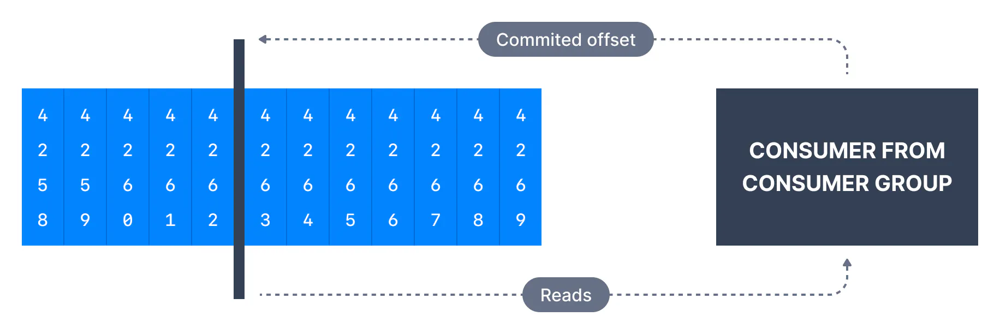

A consumer is expected to read from a log continuously.

Kafka Consumer Offets

Kafka consumers have a configuration for how to behave when they don’t have a previously committed offset. This can happen if the consumer application has a bug and it is down. For example, if Kafka has a retention of 7 days, and your consumer is down for more than 7 days, the offsets are "invalid" as they will be deleted.

In this case, consumers have a choice to either start reading from the beginning of the partition or from the end of the partition. This is controlled by the consumer configuration - `auto.offset.reset`

## auto.offset.reset

Three possible values:

- `latest` (default) which means consumers will read messages from the tail of the partition

- `earliest` which means reading from the oldest offset in the partition

- `none` throw exception to the consumer if no previous offset is found for the consumer's group

## offset.retention.minutes

The default retention period for message offsets in Kafka (version **>= 2.0)** is one week (7 days). It is a broker level setting. It is the offset retention period for the `__consumer_offsets` topic (in minutes).

Super Important:

**This setting is particularly helpful to increase in case you expect your consumers to be down for more than 1 week (and therefore lose their committed offsets), or if your topics are low-throughput topics and the consumer has not processed data for more than 1 week.** In that case, if the consumer did lose its offset, the \`auto.reset.offset\` setting would kick in. If you would like to avoid that case, increase the value of \`offset.retention.minutes\` to something like 1 month.

## Replaying data for Consumers

You can find [here a CLI tutorial](https://www.conduktor.io/kafka/kafka-consumer-group-management-cli-tutorial/) on how to reset consumer offsets.

It is possible to read data whose offsets are earlier than the partition commits. This may be required in unexpected circumstances to recover from errors. To replay data for a consumer group:

- Take all the consumers from a specific group down

- Use `kafka-consumer-groups` command to set offset to what you want (or Conduktor)

- Restart consumers

Bottom line

- Set proper data retention period & offset retention period

- Ensure the auto offset reset behavior is the one you expect or want

- Use replay capability in case of unexpected behavior

## Alternative to Using Offsets

As an alternative to using Consumer Groups and offsets, you can manually read from topics using your own strategy using the lower level API such as `.seek()` and `.assign()`

An example of these APIs being used is available in [Java Consumer Seek & Assign](https://www.conduktor.io/kafka/java-consumer-seek-and-assign/)

###### Was this content helpful?