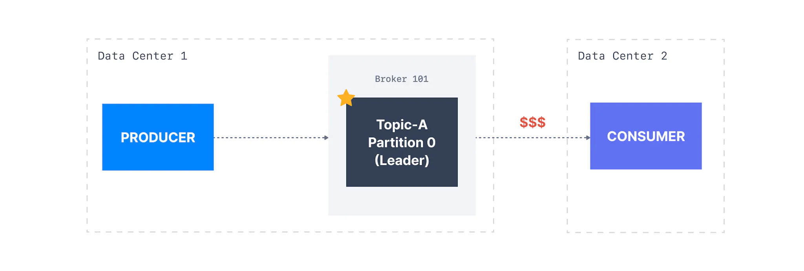
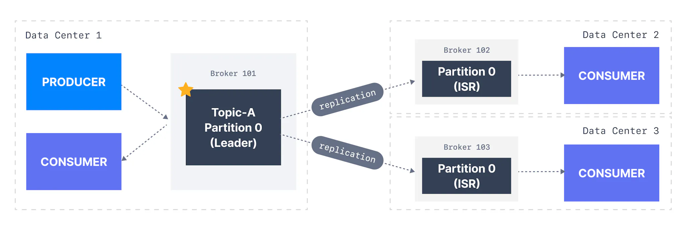

Kafka Consumers read by default from the broker that is the leader for a given partition.

In case you have multiple data centers, you run the risk of a slightly higher latency, as well as high network charges if you're being billing for cross data centers network traffic (which is the case with cloud computing platforms such as AWS).

Since Kafka 2.4, it is possible to configure consumers to read from the closest replica. This may help improve latency, and also decrease network costs if using the cloud.

To setup, you must set the following settings:

**Broker setting (must be version Kafka v2.4+):**

- `rack.id` config must be set to the data centre ID (ex: AZ ID in AWS)

- Example for AWS: AZ ID `rack.id=usw2-az1`

- `replica.selector.class` must be set to `org.apache.kafka.common.replica.RackAwareReplicaSelector`

**Consumer Client setting (v2.4+):**

- Set `client.rack` to the data centre ID the consumer is launched on

- Example for AWS `client.rack=usw2-az1`

###### Was this content helpful?