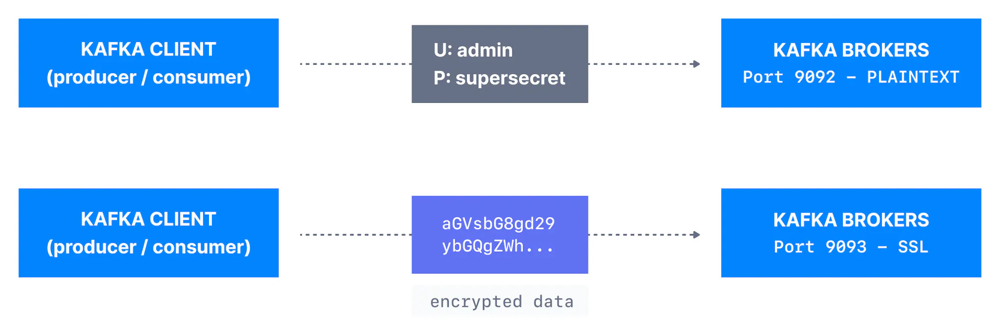
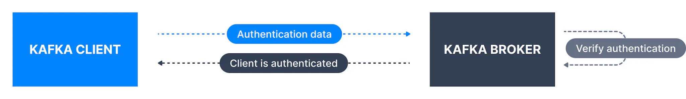
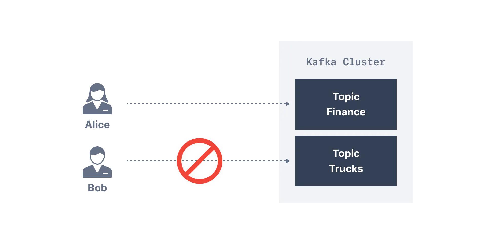

## Apache Kafka and the need for security

**With a standard Kafka setup, any user or application can write any messages to any topic, as well as read data from any topic.** As your company moves towards a shared tenancy model where multiple teams and applications use the same Kafka Cluster, or your Kafka Cluster starts onboarding some critical and confidential information, you need to implement security.

___

## Problems Kafka Security is solving

Kafka Security has three components:

- **Encryption of data in-flight using SSL / TLS:** This allows your data to be encrypted between your producers and Kafka and your consumers and Kafka. This is a very common pattern everyone has used when going on the web. That’s the “S” of HTTPS (that beautiful green lock you see everywhere on the web).

- **Authentication using SSL or SASL:** This allows your producers and your consumers to authenticate to your Kafka cluster, which verifies their identity. It’s also a secure way to enable your clients to endorse an identity. Why would you want that? Well, for authorization!

- **Authorization using ACLs:** Once your clients are authenticated, your Kafka brokers can run them against access control lists (ACLs) to determine whether or not a particular client would be authorized to write or read to some topic (or any Kafka resource in general).

___

## Encryption (SSL)

Encryption solves the problem of the man in the middle (MITM) attack. That’s because your packets, while being routed to your Kafka cluster, travel your network and hop from machines to machines. If your data is PLAINTEXT (by default in Kafka), any of these routers could read the content of the data you’re sending:

Kafka SSL Encryption for Dummies

Now with Encryption enabled and carefully setup SSL certificates, your data is now encrypted and securely transmitted over the network. With SSL, only the first and the final machine have the ability to decrypt the packet being sent.

This encryption comes at a cost: CPU is now leveraged for both the Kafka Clients and the Kafka Brokers in order to encrypt and decrypt packets. SSL Security comes at the cost of performance, but it’s low to negligible.

If you are using Java JDK 11, you will get a substantial performance improvement on SSL

**Please note the encryption is only in-flight and the data still sits un-encrypted on your broker’s disk.**

___

## Authentication (SSL & SASL)

Kafka Authentication for Dummies

There are two ways to authenticate your Kafka clients to your brokers: SSL and SASL. Let’s go over both

### SSL Authentication

SSL Auth is basically leveraging a capability from SSL called two ways authentication. The idea is to also issue certificates to your clients, signed by a certificate authority, which will allow your Kafka brokers to verify the identity of the clients.

### SASL Authentication

SASL stands for Simple Authorization Service Layer. The idea is that the authentication mechanism is separated from the Kafka protocol (which is a nice idea). It’s very popular with Big Data systems and Big Data setups for example Hadoop would probably already leverage Kerberos.

SASL takes many shapes and forms and the following are supported by Kafka

- **SASL PLAINTEXT:** This is a classic username/password combination. These usernames and passwords have to be stored on the Kafka brokers in advance and each change needs to trigger a rolling restart. It’s very annoying and not the recommended kind of security. If you use SASL/PLAINTEXT, make sure to also enable SSL encryption so that credentials aren’t sent as PLAINTEXT on the network

- **SASL SCRAM:** This is a username/password combination alongside a challenge (salt), which makes it more secure. On top of this, username and password hashes are stored in Zookeeper (and will be stored in a Kafka topic when Zookeeper is removed), which allows you to scale security without rebooting brokers. If you use SASL/SCRAM, make sure to enable SSL encryption so that credentials aren’t sent as PLAINTEXT on the network

- **SASL GSSAPI (Kerberos):** This is based on Kerberos ticket mechanism, a very secure way of providing authentication. Microsoft Active Directory is the most common implementation of Kerberos. SASL/GSSAPI is a great choice for big enterprises as it allows the companies to manage security from within their Kerberos Server. Additionally, communications are encrypted to SSL encryption is optional with SASL/GSSAPI. Needless to say, setting up Kafka with Kerberos is the most difficult option, but worth it in the end.

- **SASL OAUTHBEARER**: This will allow you to leverage OAUTH2 token for authentication, read more in the [Kafka documentation](https://kafka.apache.org/documentation/#security_sasl_oauthbearer). Currently it is said [not to be ready for production](https://kafka.apache.org/documentation/#security_sasl_oauthbearer_security) due to the usage of Unsecured JSON Web Tokens.

___

ACL for Dummies

Once your Kafka clients are authenticated, Kafka needs to be able to decide what they can and cannot do. This is where Authorization comes in, controlled by Access Control Lists (ACLs). **ACLs are what you expect them to be: User A can(‘t) do Operation B on Resource C from Host D**. Rules now support prefixes thanks to the new [`AclAuthorizer`](https://kafka.apache.org/documentation/#security_authz).

**ACL are great because they can help you prevent disasters.** For example, you may have a topic that needs to be writeable from only a subset of clients or hosts. You want to prevent your average user from writing anything to these topics, hence preventing any data corruption or deserialization errors. ACLs are also great if you have some sensitive data and you need to prove to regulators that only certain applications or users can access that data.

To add ACLs, you can use the `kafka-acls` command ([documentation here](https://kafka.apache.org/documentation/#security_authz_cli)). It also even has some facilities and shortcuts to add producers or consumers.

`1` `kafka-acls --topic test --producer --bootstrap-server localhost:9092 --add --allow-principal User:alice`

The result being:

`1` ``Adding ACLs for resource `Topic:test`: User:alice has Allow permission for operations: Describe from hosts: * User:alice has Allow permission for operations: Write from hosts: *Adding ACLs for resource `Cluster:kafka-cluster`: User:alice has Allow permission for operations: Create from hosts: *``

ACLs & Zookeeper

Do not use the option `--authorizer-properties zookeeper.connect=localhost:2181` with the `kafka-acls` command because Zookeeper is going away and now brokers directly support handling these admin API commands.

Please note that for now, your ACLs are stored in Zookeeper. Therefore, it is important to secure Zookeeper and make sure only your Kafka brokers are allowed to write to Zookeeper (`zookeeper.set.acl=true`). Otherwise any user could come in and edit ACLs, hence defeating the point of security.

___

## Next Steps

Now that you’re interested in learning about security, or even setting it up for your cluster, you’re going to have to go hands deep in it. This is going to be a fun and frustrating experience. To help, couple of resources:

- [Kafka Documentation on Security](https://kafka.apache.org/documentation/#security): it is comprehensive but will require many reads and tries to make your setup work. Nonetheless, try to read it

- [Confluent Documentation on Security](https://docs.confluent.io/4.0.0/security.html): it is complete and comes with some hands-on to secure most Kafka components (including Kafka Connect, Kafka Schema Registry, etc…)