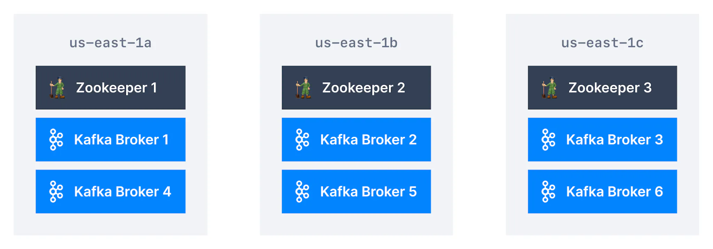

At a bare minimum, a realistic Kafka cluster should have the following architecture:

- To make the cluster highly available and performant, you want multiple brokers in different data centers (racks) to distribute your load. If you are setting up your cluster in AWS, this will be at least three different availability zones.

- You also want a cluster of at least 3 Zookeeper nodes (if using Zookeeper, the alternative being KRaft mode)

Kafka Cluster in AWS

In AWS, an Availability Zone (AZ) is one or more discrete data centers with redundant power, networking, and connectivity in an AWS Region. All the Zookeeper nodes and Kafka brokers should be spread evenly across the AZs. Here, we have three AZs - **us-east-1a**, **us-east-1b,** and **us-east-1c**. The three Zookeeper nodes are placed in these three AZs for fault tolerance. The six brokers in the cluster are similarly spread evenly across the three AZs

## Kafka Cluster Setup Gotchas

Kafka cluster has many components for reasons of performance and high availability. It is important to remember a few important points while setting up a Kafka cluster.

- It’s not easy to set up a cluster. This is a huge effort and needs dedicated effort. This is why managed Kafka solutions are getting more and more popular ( [Amazon MSK](https://aws.amazon.com/msk/), [Confluent Cloud](https://www.confluent.io/confluent-cloud/), [Aiven](https://aiven.io/), [CloudKarafka](https://www.cloudkarafka.com/), [Instaclustr](https://www.instaclustr.com/), [Upstash](https://upstash.com/), etc...)

- You want to isolate each Zookeeper & Broker on separate servers. It is not safe to host multiple Kafka components on the same machine as they will compete for resources and make the cluster fail easily in case of errors.

- Monitoring needs to be implemented. As with any distributed system, to understand how the whole system is behaving, it is essential to have a good monitoring system implemented.

- Operations have to be mastered. There are several operations that are required to be performed on a Kafka cluster while it is in operation. For example, upgrades, backups, etc.

- You need a really good Kafka Admin. This role is essential and we need a dedicated Kafka administrator to manage the cluster.

## How many Kafka brokers do I need?

The first factor is to understand how much disk space you're going to need to retain the messages based on your retention policy (one week of data by default) and your expected total throughput.

If your whole cluster needs 50TB of storage and each broker can only have 10 TB of storage, you will need at least 5 brokers.

To understand how much storage you need, you also need to take into account the replication factor.

If for example, your write data at 2MB/s in your Kafka cluster across all topics, you need to retain 1 month of data at any time, and you have a replication factor of 3, then you need

`1 2` `Total Size in MB = 2MB * 3600 * 24 * 30 * 3 (replication factor) = 15552000MB Total Size in TB = 15.552 TB`

The second factor is that you need to understand your network, CPU and memory requirements for your brokers so you size them appropriately and can handle peak load of throughput. This depends on how many producers and consumers you expect to have as each of these will consume a part of your broker network interface.

All of these metrics need to be monitored (on top of system metrics such as OpenFileDescriptor, GC time, system load...) and you need to be ready to eventually add more brokers to handle the increased load in your cluster.

## Managed Kafka

As an alternative, there are many vendors that offer Kafka as a fully managed service that can be deployed on the cloud of your choice. With a managed Kafka solution, you can focus on building your core apps. The security, uptime, and management of the Kafka cluster will be taken care of by the vendor at a price.

Example of vendors are [Amazon MSK](https://aws.amazon.com/msk/), [Confluent Cloud](https://www.confluent.io/confluent-cloud/), [Aiven](https://aiven.io/), [CloudKarafka](https://www.cloudkarafka.com/), [Instaclustr](https://www.instaclustr.com/), [Upstash](https://upstash.com/).