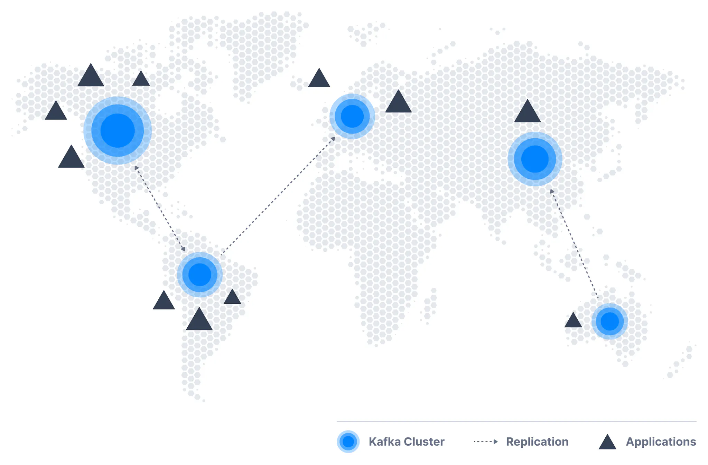
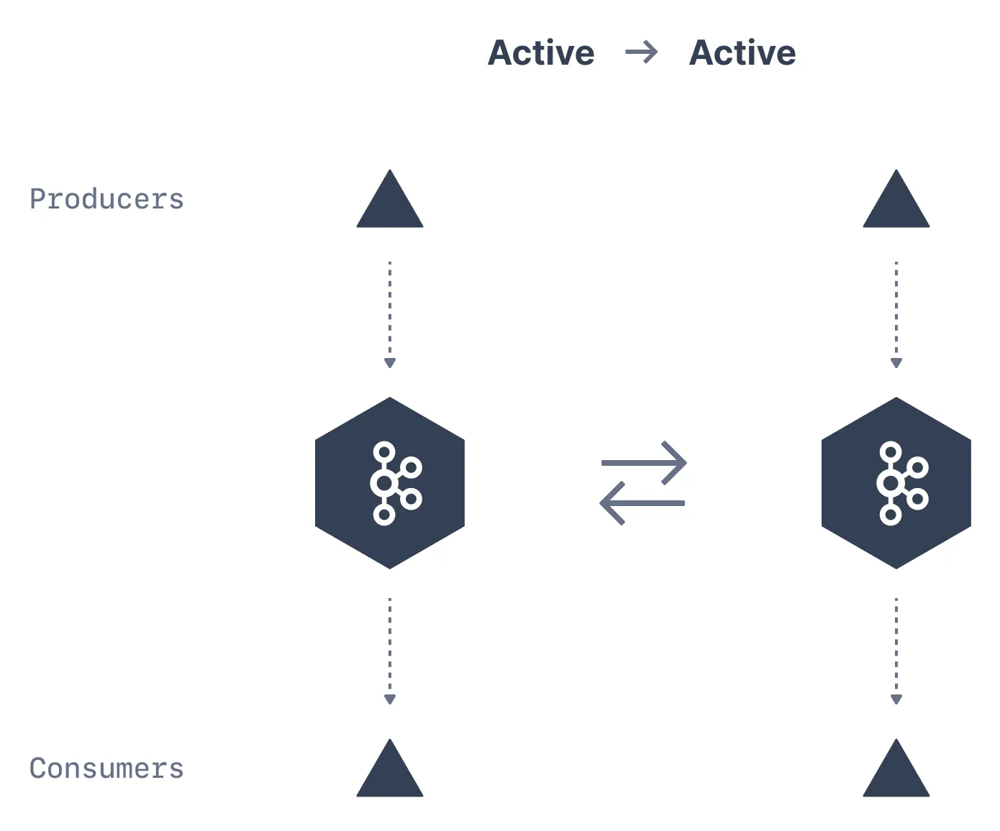
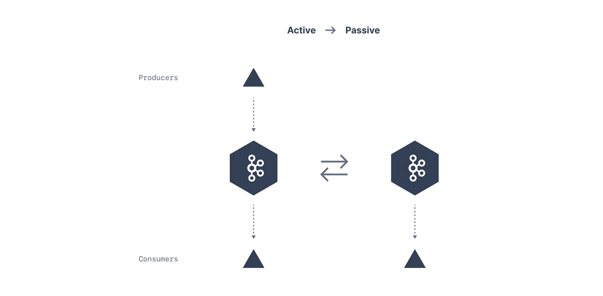

There are a few scenarios in which an architecture may need more than one cluster. It is very common for enterprises to have Kafka clusters across the world, with some level of replication between them.

In some cases, the company has one or more data centers in different geographical regions, cities, or continents. Each data center has its own Kafka cluster.

Kafka Multi-Cluster

## Cross-Cluster Mirroring

Some applications may require data from multiple data centers. The administrators will then need to continuously copy data between the clusters. A mirroring application at its core is a consumer plus a producer. In the process of mirroring, it consumes data from one cluster and publishes them to another cluster.

There are different tools to perform mirroring:

- Mirror Maker 2 - an open-source Kafka Connect connecter that ships with Kafka

- Netflix uses Flink – they wrote their own application

- Uber uses uReplicator – addresses performance and operations issues with Mirror Maker

- Comcast has their own open-source Kafka Connect Source

- Confluent has its own Kafka Connect Source. This requires a paid license to use it.

Let us look at a few architectures that are used to implement these use cases and discuss the pros and cons of each architecture pattern.

## Active-Active Architecture

This architecture is used when two or more data centers share some or all of the data and each data center is able to both produce and consume events.

Producers produce to the same topic in both the clusters, and mirroring occurs between two topics in the clusters.

Active-active Mirroring

#### Advantages

The advantages of this architecture are:

- Ability to serve users from a nearby data center, which typically has performance benefits

- Redundancy and resilience. Since every data center has all the functionality, if one data center is unavailable you can direct users to a remaining data center.

#### Disadvantages

The main drawback of this architecture is the challenges in avoiding conflicts when data is read and updated asynchronously in multiple locations. Also, you need to handle where to read from using your consumers (usually using timestamps) as offsets are not necessarily synchronized across clusters (it depends on what you're using for the replication mechanism).

## Active-Passive Architecture

In some cases, the only requirement for multiple clusters is to support some kind of disaster scenario or to enable faster reads locally by mirroring an entire cluster. Perhaps you have two clusters in the same data center. You use one cluster for all the applications, but you want a second cluster that contains (almost) all the events in the original cluster that you can use if the original cluster is completely unavailable.

In this architecture, producers publish data to the active cluster only. The passive cluster receives no writes, it just receives the mirrored data from the active cluster by Mirror Maker.

Active-Passive Mirroring

#### Advantages

The advantages of this architecture are:

- Simplicity in setup and the fact that it can be used in pretty much any use case

- No need to worry about access to data, handling conflicts, and other architectural complexities.

#### Disadvantages

The disadvantages are the waste of a good cluster and the fact that it is currently not possible to perform cluster failover in Kafka without either losing data or having duplicate events.

Offsets Aren't Always Preserved

Replicating may not necessarily preserve offsets, just data! Data at an offset in one cluster may not be the same as the data at the same offset in another cluster.

As of Mirror Maker 2 in Kafka 2.7, you can leverage the setting \`sync.group.offsets.enabled\`

#### Further readings

For further readings on this topic, the following are a good set of references.

- [https://github.com/apache/kafka/blob/trunk/connect/mirror/README.md](https://github.com/apache/kafka/blob/trunk/connect/mirror/README.md)

- [https://engineering.salesforce.com/mirrormaker-performance-tuning-63afaed12c21](https://engineering.salesforce.com/mirrormaker-performance-tuning-63afaed12c21)

- [https://docs.confluent.io/current/multi-dc/replicator-tuning.html#improving-network-utilization-of-a-connect-task](https://docs.confluent.io/current/multi-dc/replicator-tuning.html#improving-network-utilization-of-a-connect-task)

- [https://community.hortonworks.com/articles/79891/kafka-mirror-maker-best-practices.html](https://community.hortonworks.com/articles/79891/kafka-mirror-maker-best-practices.html)

- [https://www.confluent.io/kafka-summit-sf17/multitenant-multicluster-and-hieracrchical-kafka-messaging-service](https://www.confluent.io/kafka-summit-sf17/multitenant-multicluster-and-hieracrchical-kafka-messaging-service)

- [https://eng.uber.com/ureplicator/](https://eng.uber.com/ureplicator/)

- [https://www.altoros.com/blog/multi-cluster-deployment-options-for-apache-kafka-pros-and-cons/](https://www.altoros.com/blog/multi-cluster-deployment-options-for-apache-kafka-pros-and-cons/)

- [https://github.com/Comcast/MirrorTool-for-Kafka-Connect](https://github.com/Comcast/MirrorTool-for-Kafka-Connect)