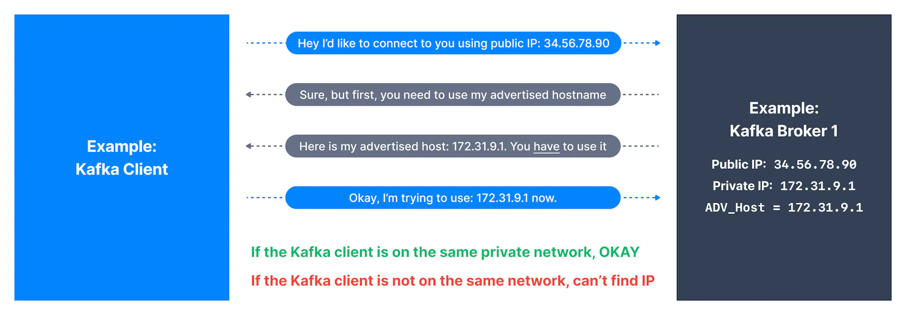
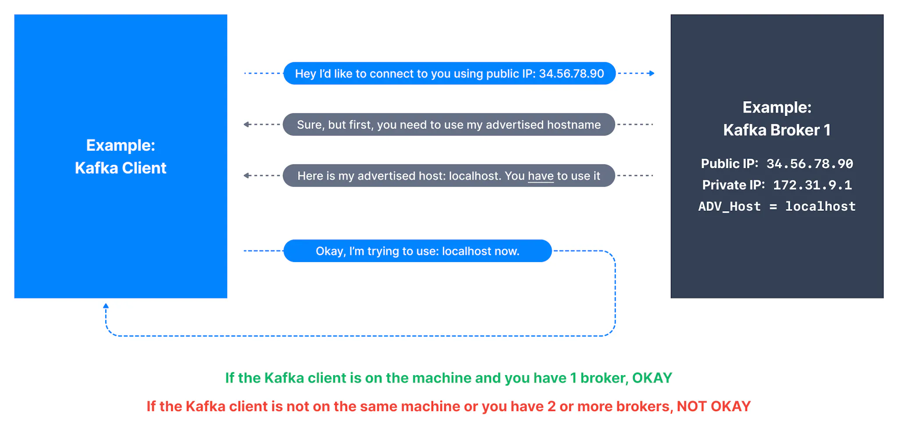
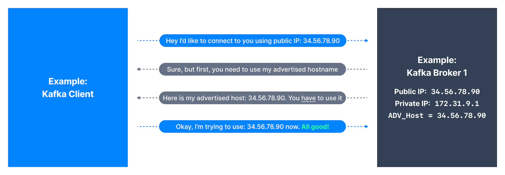

Advertised listeners is the most important setting of Kafka and setting it correctly ensures your clients all over your network can successfully connect to every broker in your Kafka cluster.

## Connecting to a Kafka cluster

When a client is connecting to a Kafka cluster, regardless of how the client first connected to the broker, the broker will reply to the initial request with an advertised host that the client MUST use for all future communications.

If this advertised host is misconfigured, the client will not be able to successfully keep on exchanging data with the Kafka broker.

Bottom line: it's not because a Kafka hostname and port are reachable that the clients will necessarily be able to establish successfully a Kafka-protocol connection to it.

See the example below:

Connection Establishment

If the Advertised Host IP is in the same network as the Kafka client, it will connect fine, otherwise connection will fail.

## Setting Advertised Host as localhost

If you set the Advertised Host as localhost, the Kafka client will successfully connect to the cluster if it is running on the same machine as the broker.

Connecting to Localhost

## Setting Advertised Host as Public IP

If you set the Advertised Host as the broker's Public IP, the Kafka client will successfully connect to the cluster as long as the Public IP doesn't change. It may change if the broker re-boots. If that happens, the connection cannot be re-established.

Connecting to Public IP

Having examined the nuances involved with setting the Advertised Host, let us see safer ways to set the Advertised Host of a broker.

If your clients are local to the broker’s network, set either:

- the internal private IP

- the internal private DNS hostname. Your clients should be able to resolve the internal IP or hostname

If your clients are on a public network, set either:

- The external public IP

- The external public DNS hostname pointing to the public IP. Your clients must be able to resolve the public DNS

For an in-depth explanation of Kafka Listeners, [have a look here](https://rmoff.net/2018/08/02/kafka-listeners-explained/).