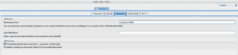
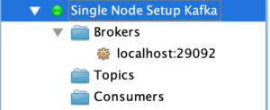
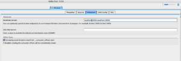

If you have a few years of experience in the DevOps ecosystem, and you're interested in sharing that experience with the community, have a look at our [**Contribution Guidelines**](https://www.baeldung.com/ops/contribution-guidelines).

## 1\. Overview[](https://www.baeldung.com/ops/kafka-docker-setup#overview)

**Docker is one of the most popular container engines** used in the software industry to **create, package, and deploy applications.**

In this tutorial, we’ll learn how to perform an [Apache Kafka](https://www.baeldung.com/spring-kafka#overview) setup using Docker.

Critically, since version 2.8.0, Apache Kafka supports a mode that doesn’t depend on ZooKeeper. Further, **as of Confluent Platform 7.5, ZooKeeper is deprecated**. This is why **we specifically indicate the versions of both the ZooKeeper and Kafka containers as _7.4.4_**.

## 2\. Single Node Setup[](https://www.baeldung.com/ops/kafka-docker-setup#single-node-cluster)

A single-node Kafka broker setup would meet most of the **local development needs**, so let’s start by learning this simple setup.

### 2.1. _docker-compose.yml_ Configuration[](https://www.baeldung.com/ops/kafka-docker-setup#docker-compose-file)

To start an Apache Kafka server, we’d first need to start a [Zookeeper](https://www.baeldung.com/java-zookeeper#overview) server.

We can **configure this dependency in a _[docker-compose.yml](https://www.baeldung.com/docker-compose)_ file**, which ensures that the Zookeeper server always starts before the Kafka server and stops after it.

Let’s create a simple _docker-compose.yml_ file with two services, namely _zookeeper_ and _kafka_:

```yaml
$ cat docker-compose.yml version: '2' services: zookeeper: image: confluentinc/cp-zookeeper:7.4.4 environment: ZOOKEEPER_CLIENT_PORT: 2181 ZOOKEEPER_TICK_TIME: 2000 ports: - 22181:2181 kafka: image: confluentinc/cp-kafka:7.4.4 depends_on: - zookeeper ports: - 29092:29092 environment: KAFKA_BROKER_ID: 1 KAFKA_ZOOKEEPER_CONNECT: zookeeper:2181 KAFKA_ADVERTISED_LISTENERS: PLAINTEXT://kafka:9092,PLAINTEXT_HOST://localhost:29092 KAFKA_LISTENER_SECURITY_PROTOCOL_MAP: PLAINTEXT:PLAINTEXT,PLAINTEXT_HOST:PLAINTEXT KAFKA_INTER_BROKER_LISTENER_NAME: PLAINTEXT KAFKA_OFFSETS_TOPIC_REPLICATION_FACTOR: 1
```

In this setup, our Zookeeper server is listening on port=_2181_ for the _kafka_ service, which is defined within the same container setup. However, for any client running on the host, it’ll be exposed on port _22181_.

Similarly, the **_kafka_ service is exposed to the host applications through port _29092_**, but it’s actually advertised on port _9092_ within the container environment **configured by the _KAFKA\_ADVERTISED\_LISTENERS_** property.

### 2.2. Start Kafka Server[](https://www.baeldung.com/ops/kafka-docker-setup#start-kafka-server)

Let’s start the Kafka server by spinning up the containers using the [_docker-compose_](https://www.baeldung.com/ops/docker-compose) command:

```bash
$ docker-compose up -d Creating network "kafka_default" with the default driver Creating kafka_zookeeper_1 ... done Creating kafka_kafka_1 ... done
```

Now, let’s use the **[_nc_](https://www.baeldung.com/linux/netcat-command#scanning-for-open-ports-using-netcat) command to verify that both the servers are listening on the respective ports**:

```bash
$ nc -zv localhost 22181 Connection to localhost port 22181 [tcp/*] succeeded! $ nc -zv localhost 29092 Connection to localhost port 29092 [tcp/*] succeeded!
```

Additionally, we can also check the verbose logs while the containers are starting up and verify that the Kafka server is up:

```bash
$ docker-compose logs kafka | grep -i started kafka_1 | [2024-02-26 16:06:27,352] DEBUG [ReplicaStateMachine controllerId=1] Started replica state machine with initial state -> HashMap() (kafka.controller.ZkReplicaStateMachine) kafka_1 | [2024-02-26 16:06:27,354] DEBUG [PartitionStateMachine controllerId=1] Started partition state machine with initial state -> HashMap() (kafka.controller.ZkPartitionStateMachine) kafka_1 | [2024-02-26 16:06:27,365] INFO [KafkaServer id=1] started (kafka.server.KafkaServer)
```

With that, our Kafka setup is ready for use.

### 2.3. Connection Using Kafka Tool[](https://www.baeldung.com/ops/kafka-docker-setup#connect-kafka-tool)

Finally, let’s use the **[Kafka Tool](https://kafkatool.com/download.html) GUI utility to establish a connection with our newly created Kafka server**, and later, we’ll visualize this setup:



Notably, we might need to use the **_Bootstrap servers_ property to connect to the Kafka server** listening at port _29092_ from the host machine.

Finally, we should be able to visualize the connection on the left sidebar:



As such, the entries for _Topics_ and _Consumers_ are empty, since it’s a new setup. Once we have some topics, we should be able to visualize data across partitions. Moreover, if there are active consumers connected to our Kafka server, we can view their details too.

## 3\. Kafka Cluster Setup[](https://www.baeldung.com/ops/kafka-docker-setup#kafka-cluster-setup)

For more stable environments, we’ll need a resilient setup. Let’s **extend our _docker-compose.yml_ file to create a multi-node Kafka cluster setup.**

### 3.1. _docker-compose.yml_ Configuration[](https://www.baeldung.com/ops/kafka-docker-setup#docker-compose)

A cluster setup for Apache Kafka needs to have redundancy for both Zookeeper servers and the Kafka servers.

So, let’s add configuration for one more node each for Zookeeper and Kafka services:

```yaml
$ cat docker-compose.yml --- version: '2' services: zookeeper-1: image: confluentinc/cp-zookeeper:7.4.4 environment: ZOOKEEPER_CLIENT_PORT: 2181 ZOOKEEPER_TICK_TIME: 2000 ports: - 22181:2181 zookeeper-2: image: confluentinc/cp-zookeeper:7.4.4 environment: ZOOKEEPER_CLIENT_PORT: 2181 ZOOKEEPER_TICK_TIME: 2000 ports: - 32181:2181 kafka-1: image: confluentinc/cp-kafka:7.4.4 depends_on: - zookeeper-1 - zookeeper-2 ports: - 29092:29092 environment: KAFKA_BROKER_ID: 1 KAFKA_ZOOKEEPER_CONNECT: zookeeper-1:2181,zookeeper-2:2181 KAFKA_ADVERTISED_LISTENERS: PLAINTEXT://kafka-1:9092,PLAINTEXT_HOST://localhost:29092 KAFKA_LISTENER_SECURITY_PROTOCOL_MAP: PLAINTEXT:PLAINTEXT,PLAINTEXT_HOST:PLAINTEXT KAFKA_INTER_BROKER_LISTENER_NAME: PLAINTEXT KAFKA_OFFSETS_TOPIC_REPLICATION_FACTOR: 1 kafka-2: image: confluentinc/cp-kafka:7.4.4 depends_on: - zookeeper-1 - zookeeper-2 ports: - 39092:39092 environment: KAFKA_BROKER_ID: 2 KAFKA_ZOOKEEPER_CONNECT: zookeeper-1:2181,zookeeper-2:2181 KAFKA_ADVERTISED_LISTENERS: PLAINTEXT://kafka-2:9092,PLAINTEXT_HOST://localhost:39092 KAFKA_LISTENER_SECURITY_PROTOCOL_MAP: PLAINTEXT:PLAINTEXT,PLAINTEXT_HOST:PLAINTEXT KAFKA_INTER_BROKER_LISTENER_NAME: PLAINTEXT KAFKA_OFFSETS_TOPIC_REPLICATION_FACTOR: 1
```

Importantly, **we should ensure that the service names and _KAFKA\_BROKER\_ID_ are unique** across the services.

Moreover, each service must **expose a unique port to the host machine.** Although _zookeeper-1_ and _zookeeper-2_ are listening on port _2181_, they’re exposing it to the host via ports _22181_ and _32181_, respectively. The same logic applies to the _kafka-1_ and _kafka-2_ services, which listen on ports _29092_ and _39092_, respectively.

### 3.2. Start the Kafka Cluster[](https://www.baeldung.com/ops/kafka-docker-setup#spin-up-cluster)

Let’s spin up the cluster by using the _docker-compose_ command:

```bash
$ docker-compose up -d Creating network "kafka_default" with the default driver Creating kafka_zookeeper-1_1 ... done Creating kafka_zookeeper-2_1 ... done Creating kafka_kafka-2_1 ... done Creating kafka_kafka-1_1 ... done
```

Once the cluster is up, let’s use the Kafka Tool to connect to the cluster by specifying comma-separated values for the Kafka servers and respective ports:



Finally, let’s take a look at the multiple broker nodes available in the cluster:


## 4\. Conclusion[](https://www.baeldung.com/ops/kafka-docker-setup#conclusion)

## 4\. Conclusion[](https://www.baeldung.com/ops/kafka-docker-setup#conclusion-1)

In this article, we **used the Docker technology to create single-node and multi-node setups of Apache Kafka.**

We also used the Kafka Tool to connect and visualize the configured broker server details.

Comments are open for 30 days after publishing a post. For any issues past this date, use the Contact form on the site.